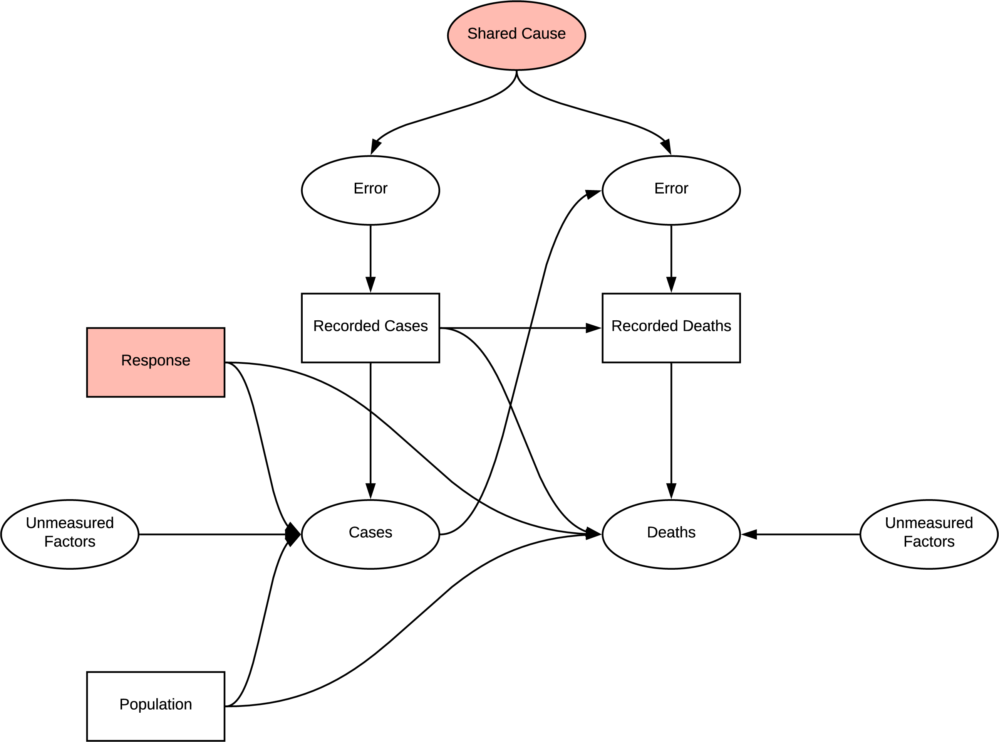

```{r setup, include=FALSE}
knitr::opts_chunk$set(echo = TRUE)
```

```{r}
library(tidyverse)
library(lavaan)
library(lubridate)
library(visdat)
library(dagitty)
library(janitor)
library(cowplot)
library(scales)
library(semPlot)
library(gfoRmula)
library(ggdag)
library(semTools)
library(data.table)
```
# Intent


## Aim
The outcomes of this exploration focused on identifying relationships between countries. In our previous research different facets of the structure of the COVID-19 pandemic were identified, higher risk to older populations and those with chronic diseases. Aditonally, attempts were made to understand the variation between the outcomes within each country, mobility, goverment trust and healthcare factors were considered [@dannyleihanCOVID19COVIDResearch202007272020]. The process of the previous research developed and informed an implied structure of interactions within the pandemic. Utilisng Structure Equation Modelling (SEM), we can test this implied structure, and potentially subsets of the structure, to identify if the lack of clear outcomes was due to a missunderstanding of the causal pathways involved related to the pandemic and the observations captured.

## Research Questions
1. Assess the validity of implied structure of of understanding in the previous research undertaken
3. Assess alternative structures for improvement

## Outcomes
1. Construct a causal Directed Acyclic Graph (DAG) of the implied structure from the report
2. Identify biases within the implied DAG
4. From the DAG construct a SEM relating the available data to measured variables and implied structure to latent endegenous and exegenous variables
5. Use SEM to assess the fit of this implied structure to the available data
6. Develop an atlernate DAG and SEM

## Rational
Any attempts to draw conclusions or further our previous research will be built upon conclusions made under the model of causation that we assumed when developing the research. Fundamental flaws and bias are likely to only proliferate through subsequent research attempts, reinforced by any, potentially innacruate, findings of the previous work. Evaluating the accuracy of our assumed structure enables us to understand if the outcomes or lack of outcomes were due to actual associations within the data or due to incorrect structure and bias.

It may prove that the less complex structure that is implied through the research into risk factors was more accurate than the broad structure implied in the subsequent exploration into variation. Improving the structure we evaluate future research questions against will reduce the bias and error in those attempts, however, due to the complexity of the problem this may not be feasible.

#### Errors
It should be noted that while diligence has been attempted, I am by no means an expert in any of the topics addressed in this document, errors in interpretion are likely. The repository for this report will be made public [on GitHub here](https://github.com/jsmccid/STDS-AT3/) once marked. If any errors are identified, please raise them as issues on GitHub or feel free to make modifications yourself and submit a pull request. Assistance here is greatly appreciated as this is an interesting and very complex field, this work represents a first learning experience with many of the concepts presented.

# Implied Structure
The implications of the previous research are collated in [Appendix B](#appendix-b). With approximatley 69 implications observable in the previous research a complex causal structure has developed, visualised below. 

## Introduction
The following figure indicates the casual graph implied in the introduction, the implied structure contains many sources of systematic bias. The first challenge is that the measured statistics are subject to measurement bias, particuarly, as difference in classifications, and undiagnosed patients are a common cause of error. Additonally, as being diagnosed with COVID is likely to influence your chance of death and weather your death will be recorded as COVID related, the bias is dependent differential bias. When trying to determine the effect of population on deaths there is confouding due to the common cause of response, simiarly there is confounding if any unmeasured factor effecting cases and deaths are common. There is also potential for selection bias at the colider Deaths, as we would be conditining on recorded deaths in analysis.



## Country Based Age Influence
When investigating the effect of age on deaths, conditioning age on higher values opens up the path to other unmeasured effects on age identified. Previously identified measurement bias is consistent. Regression on age is a viable method of reducing the effect of confounding due to common cause of age, however the measurement bias is still present.


## Patient Case Based Analysis
In verifying the reason for using this dataset we instead identify two potential shared causes for error inducing measurement bias; disclosure and time since first case. Additonally as this research in focused on patient data, the location variable is introduced, a common cause of many of the observations. It is identified that we can condition on this variable with USA and observe changes in distributions, however the research did not utilise this in regression. The direction of the graph becomes quite complex with the introduction of chronic disease, we also intorduce another source of differntial dependent error. In determining if there is a connection between chronic disease and particular symptons, conditoning symptoms opens the collider inducing selection bias, age appears to act as an additional condfounder.


## Factors and Effectiveness
All the factor analysis introduceed selection bias as they select for varying conditions of outcome variables or deaths, in addition to the other bias's observed previously. It us likely in real world scenarios these would represent common cause and act as confounders.


## Time Varying Treatment
In both the patient based and repsone investigations, time varying treament bias is introduced into the model, the complexity in displaying this prevents visualisation. In patient based investigation, the bias is due to the effect of the change in quality of treatment as understanding of the virus improved effecting the the symptoms and observed. In the response investigations, as the response effects both cases and future response we see a similar effect. Dealing with these biases would require implimenting G-methods.


## Full Implied Structure
Tthe implied structure by the research is quite flawed and has many inherent sources of systematic bias in the experitments undertaken which were not accounted for. The structure is also exteremly complex developed as the research progressed.


## Simplified DAG
The below DAG is an attempt to simplify the implied structure into a model that can be interpreted using SEM with the available data. This model not include any unobserved / latent variables that do not have an associated measurement, fortunatley unmeasured factors and error are inherently assumed by SEM modelling. The patient based research cannot be fully emulated along with the other country based analysis, however, some chronic risk factors are availble in country level data. Similarly, the apple mobility data was not available to join with the dataset. When making our prior implications we did not imply many covariances amongst our measurements so, so none are present in the DAG.


## Data

The datasets to be utlised are;
* Our World in Data COVID Dataset [@ourworldindataOwidCovid19data2020]

```{r, eval = FALSE}
# COVID OWID
download.file("https://raw.githubusercontent.com/owid/covid-19-data/master/public/data/owid-covid-data.csv", "./data/covid_owid.csv")

# OxCGRT
download.file("https://github.com/OxCGRT/covid-policy-tracker/raw/master/data/OxCGRT_latest.csv", "./data/oxpol.csv")

```


```{r}
covid <- read.csv("./data/covid_owid.csv")
covid$month <- lubridate::month(covid$date, label = TRUE, abbr = TRUE)
covid$week <- lubridate::week(covid$date)
covid$week <- covid$week+1
covid[covid$week == 54, "week"] <- 1 

#available data

names(covid)

#visualise missing data

vis_dat(covid, warn_large_data = FALSE)
```


```{r}
oxpol <- read_csv("./data/oxpol.csv")

vis_dat(oxpol[1:8000,], warn_large_data = FALSE)
```

*COVID OWID Summary by Week*
```{r,eval=FALSE}
coviddata_sumweek <- covid %>%
  filter(location != "World", location != "International") %>% 
  group_by(iso_code, week) %>% 
  summarise(
            week_start = first(date),
            week_end = last(date),
            new_cases = sum(new_cases),
            new_deaths = sum(new_deaths),
            new_cases_per_million = sum(new_cases_per_million),
            new_deaths_per_million = sum(new_deaths_per_million),
            new_tests = sum(new_tests),
            new_tests_per_thousand = sum(new_tests_per_thousand),
            ) %>% 
  ungroup()

join <- covid %>% 
  select(-new_cases, -new_deaths, -new_cases_per_million, -new_deaths_per_million, -new_tests, -new_tests_per_thousand, -week) %>% 
  mutate(week_end = date)

coviddata_sumweek<- merge(coviddata_sumweek, join, by = c("iso_code", "week_end"))
```

```{r}
poltrustfull <- read_csv("./data/poltrustfull.csv")

poltrustfull <- poltrustfull %>%
  mutate(iso_code = country_iso3) %>% 
  select(iso_code, x2018)
names(poltrustfull)[2] <- "trust_in_pol"

coviddata_m <- merge(coviddata_sumweek, poltrustfull, by = "iso_code")

#government effectiveness
gov_effect <- read_csv("./data/goveffect.csv")
gov_effect <- clean_names(gov_effect)
goveff <- gov_effect %>% 
  filter(indicator == "Government Effectiveness", subindicator_type == "Estimate") %>% 
  mutate(iso_code = country_iso3) %>% 
  select(iso_code, x2018)
names(goveff)[2] <- "government_eff"

coviddata_m <- merge(coviddata_m, goveff, by = "iso_code")

glostatedemoc <- read_csv("./data/globalstatedemoc.csv")
glostatedemoc <- clean_names(glostatedemoc)

glostat_health <- glostatedemoc %>% 
  filter(indicator == "Health equality" | indicator == "Basic welfare") %>% 
  mutate(iso_code = country_iso3) %>% 
  select(iso_code, indicator, x2018) %>% 
  pivot_wider(names_from = indicator, values_from = x2018) %>% 
  clean_names()

coviddata_m <- merge(coviddata_m, glostat_health, by = "iso_code")
```


The variables related to testing will be ignored as the data is only available for a small subset of the data. Additionally, testing has many unidentified and unmeasured parent assoications which cannot be accounted for such as testing restrictions, and drivers for an individual to be tested [@ourworldindataOwidCovid19data2020]. Simlarly, cases will not be used due to the uncertainty around testing. Variables related to deaths are more likely to be the outcome of in hospital or post mortem testing and therefore more accurate however COVID-19 death attirbution is known to be inconsitent between countries [@doughendrieRACGPWhyDoes2020].

### Directed Acyclic Graph (DAG)
Causal inference implies the need to understand the True DAG in order to infer a causal relationship, prior to this, a collection of causal stories or hypothesised DAGs can be used to test theories against, with the understanding that some unidentified bias may still be present. [@harvardxph559xCausalDiagramsDraw2020]

The intial DAG presented is a construct of latent variables that can reasonably be derived from the data available, to construct this dag we create Assumption 1. Within the intial DAG all observerd variables other than the outcome variable are only associated with a single latent variable. This implies we can ignore the observed variables and focus solely on the latent variables when evaluating the DAG for bias.


# Modelling

```{r}
cvd_week5dplus <- coviddata_m %>% 
  group_by(iso_code) %>% 
  mutate(stringency_index = max(na.omit(stringency_index))) %>% 
  ungroup() %>%
  filter(total_deaths >= 5) %>% 
  group_by(iso_code) %>% 
  mutate(sincefive = row_number()) %>% 
  #filter(maxdeath >=2500) %>%
  filter(total_deaths == max(total_deaths)) %>% 
  filter(date == min(date)) %>% 
  ungroup()


# cvd_week5dplus <- coviddata_m %>% 
#   filter(total_deaths >= 5) %>% 
#   group_by(iso_code) %>% 
#   mutate(sincefive = row_number(), maxdeath = max(total_deaths)) %>% 
#   #filter(maxdeath >=2500) %>%
#   filter(date == max(date)) %>% 
#   ungroup()
  
```

### Check Distributions
```{r}
# https://stackoverflow.com/questions/48507378/plotting-distributions-of-all-columns-in-an-r-data-frame
cvd_vars <- cvd_week5dplus %>% 
  select(location, total_cases_per_million, total_deaths_per_million, population, population_density, aged_65_older, aged_70_older, median_age, cvd_death_rate, diabetes_prevalence, stringency_index, government_eff, trust_in_pol, gdp_per_capita, hospital_beds_per_thousand, basic_welfare, health_equality) %>% 
  filter(stringency_index >= 0) %>% 
  na.omit()


dist_plots <- lapply(names(cvd_vars), function(var_x){
  p <- 
    ggplot(cvd_vars) +
    aes_string(var_x)

  if(is.numeric(cvd_vars[[var_x]])) {
    p <- p + geom_density()

  } else {
    p <- p + geom_bar()
  } 

})

plot_grid(plotlist = dist_plots)

ggplot(cvd_vars, aes(x = total_cases_per_million, y = total_deaths_per_million)) + geom_point() + geom_label(aes(label = location))

summary(cvd_vars$total_cases_per_million)
summary(cvd_vars$total_deaths_per_million)

cvd_vars <- cvd_vars %>% 
  filter(location != "Belgium", location != "Qatar") %>% 
  filter(total_cases_per_million >= 200, total_deaths_per_million >= 3)

ggplot(cvd_vars, aes(x = population, y = population_density)) + geom_point() + geom_label(aes(label = location), vjust = -2)

cvd_vars <- cvd_vars %>% 
  filter(location != "Singapore", location != "India", location != "China")

dist_plots <- lapply(names(cvd_vars), function(var_x){
  p <- 
    ggplot(cvd_vars) +
    aes_string(var_x)

  if(is.numeric(cvd_vars[[var_x]])) {
    p <- p + geom_density()

  } else {
    p <- p + geom_bar()
  } 

})

plot_grid(plotlist = dist_plots)

summary(cvd_vars)
```

Despite removing some outliers and a portion of the lowest values the dstributions are still quit skewed for some statistics, some mitigation can be achieved using robust functions within Lavaan. Additonally, the total number of observations has decreased significantly, and is now likely below the minimum requiement for the analysis, however as this is the best estimation that can be made analysis will proceed.


## Specify Structure
```{r}
init_model <- '
# latent variable model
pop_factors =~ population_density + population
age_risk =~ aged_65_older + aged_70_older + median_age
chronic_risk =~ cvd_death_rate + diabetes_prevalence
cases =~ total_cases_per_million
deaths =~ total_deaths_per_million
response_eff =~ trust_in_pol + government_eff + stringency_index
healthcare =~ basic_welfare + health_equality + hospital_beds_per_thousand


# regressions
cases ~ pop_factors + age_risk + response_eff
deaths ~ cases + age_risk + chronic_risk + healthcare

# covariance
chronic_risk ~~ age_risk
healthcare ~~ age_risk

'
# e1 ~~ cases
# e2 ~~ deaths
# e1 ~~ e2
# mitigations =~ 
# + population
#  + gdp_per_capita

cvd_vars <- cvd_vars %>% 
  mutate_at(vars(-location), rescale, to = c(0,1))

cvd_sem <- sem(init_model, data = cvd_vars, estimator = "MLR", check.gradient = FALSE)
summary(cvd_sem)
lavInspect(cvd_sem)
parameterestimates(cvd_sem)
summary(cvd_sem, fit.measures=TRUE, standardized=TRUE)

```

```{r}
init_model <- '
# latent variable model
pop_factors =~ population_density
age_risk =~ aged_65_older + aged_70_older + median_age
chronic_risk =~ cvd_death_rate + diabetes_prevalence
cases =~ total_cases_per_million
deaths =~ total_deaths_per_million
response_eff =~ trust_in_pol + government_eff + stringency_index
healthcare =~ basic_welfare + health_equality + hospital_beds_per_thousand

# regressions
cases ~ pop_factors + age_risk + response_eff
deaths ~ cases + age_risk + chronic_risk + healthcare
'

# chronic_risk ~ age_risk
# healthcare ~ age_risk
# mitigations =~ 
# + population
#  + gdp_per_capita

cvd_vars <- cvd_vars %>% 
  mutate_at(vars(-location), rescale, to = c(0,1))

cvd_sem <- sem(init_model, data = cvd_vars, estimator = "MLR")
summary(cvd_sem)

semPaths(cvd_sem,  what = "stand", rotation = 2, layout = "tree")

```
The model is recursive and thus should be identified, however a strong negative loading on some variables etc cases is a latent var

### Research Evaluation


## Build Up Approach and Confirmitory Factor Analysis (CFA)
A preferrable alternative to the approach taken here is to build up first a DAG, and then a model interating based on fit [@BestPracticesSEM]. An attempt at which is undetaken here. This attempt is still constrained by the data already collected, but presents an oppourtunity to guide future investigation. 

### No Measurement Error
If we assume measurement error is not present we can create a simple DAG for the effect of age, this DAG presents an oppourtunity for CFA
```{r}
a <- dagify(covid ~ age,
            death ~ age,
            death ~ covid)
ggdag(a) + theme_dag()
```

### New Outcome Variable
The previous research utilised total deaths and cumultive measures. Instead, the new outcome variable with be the new deaths per million 4 weeks or 28 days after the first 100 cases. This allows the DAG to represent a non time varying snapshot of the pandemic. This allows time for gestiation, and infection while also being on the upslope of many countries new case curves. Finally, to aid modelling the variance both new_cases_per_million and new_deaths_per_million will be log transformed.

```{r}
covid_new <- covid %>%
  filter(location != "World", location != "International") %>% 
  group_by(iso_code, week) %>% 
  summarise(
            week_start = first(date),
            week_end = last(date),
            new_cases = sum(new_cases),
            new_deaths = sum(new_deaths),
            new_cases_per_million = sum(new_cases_per_million),
            new_deaths_per_million = sum(new_deaths_per_million),
            new_tests = sum(new_tests),
            new_tests_per_thousand = sum(new_tests_per_thousand),
            stringency_index = mean(stringency_index)
            ) %>%
  ungroup()

join <- covid %>% 
  select(-new_cases, -new_deaths, -new_cases_per_million, -new_deaths_per_million, -new_tests, -new_tests_per_thousand, -week) %>% 
  mutate(week_end = date, -stringency_index)

covid_new_m <- merge(covid_new, join, by = c("iso_code", "week_end"))
```

```{r}
ggplot(covid_new_m, aes(x = week, y = total_cases, color = location)) + geom_line()+ theme(legend.position = "none") + ylim(0, 2500)
```

```{r}
cvd_100c <- covid_new_m %>% 
  group_by(iso_code) %>%
  filter(total_cases >= 100) %>% 
  arrange(week) %>% 
  mutate(weekoneplus = row_number()) %>% 
  ungroup()

ggplot(cvd_100c, aes(x = weekoneplus, y = new_cases_per_million, color = location)) + geom_line()+ theme(legend.position = "none")+ ylim(0, 2000)
```


```{r}
cvd_100c_p4 <- cvd_100c %>% 
  group_by(iso_code) %>% 
  filter(weekoneplus == 4) %>% 
  ungroup() %>% 
  mutate(logndpm = log(new_deaths_per_million), logncpm = log(new_cases_per_million))

cvd_100c_p4[cvd_100c_p4$logndpm < -1000, "logndpm"] <- 0
cvd_100c_p4[cvd_100c_p4$logncpm < -1000, "logncpm"] <- 0

ggplot(cvd_100c_p4, aes(x = median_age, y = logndpm)) + geom_point()
ggplot(cvd_100c_p4, aes(x = median_age, y = logncpm)) + geom_point()
```

```{r}
dist_plots <- lapply(list("logncpm", "logndpm", "aged_65_older", "aged_70_older", "median_age"), function(var_x){
  p <- 
    ggplot(cvd_100c_p4) +
    aes_string(var_x)

  if(is.numeric(cvd_100c_p4[[var_x]])) {
    p <- p + geom_density()

  } else {
    p <- p + geom_bar()
  } 

})

plot_grid(plotlist = dist_plots)
```


### CFA Model

#### Model 1
Though previously acknowledge as a much more unreliable statistic, cases is included, CFA will estimate this error. As before, cases and deaths are latent variables of their measured outcomes.

```{r}
cfa1_df <- cvd_100c_p4 %>% 
  mutate_at(vars(median_age, aged_65_older, aged_70_older, logncpm, logndpm), rescale, to = c(0,10))

cfa1_model <-'
# latent variables
age_risk =~ aged_70_older + median_age + aged_65_older
cases =~ logncpm
deaths =~ logndpm

# regressions (effects)
cases ~ age_risk
deaths ~ age_risk + cases

#covariances
aged_65_older ~~ aged_70_older
'

cfa1_sem <- cfa(cfa1_model, data = cfa1_df, estimator = "MLR")
varTable(cfa_sim)
summary(cfa1_sem, fit.measures=TRUE, standardized=TRUE)
semPaths(cfa1_sem,  what = "stand", rotation = 2, layout = "tree")
modificationIndices(cfa1_sem)
fitMeasures(cfa1_sem, c("chisq", "df", "pvalue", "cfi", "rmsea") ,output = "text", add.h0 = TRUE)
```

#### Fit

### CFA Model 2
```{r}

a <- dagify(covid ~ age,
            death ~ age,
            death ~ covid,
            chronic ~ age,
            death ~ chronic,
            exposure = "chronic",
            outcome = "death"
            )
ggdag(a) + theme_dag()
```

```{r}
cfa2_df <- cvd_100c_p4 %>% 
  mutate_at(vars(median_age, aged_65_older, aged_70_older, logncpm, logndpm, cvd_death_rate, diabetes_prevalence), rescale, to = c(0,10))

cfa2_model <-'
# latent variables
age_risk =~ aged_70_older + median_age + aged_65_older
cases =~ logncpm
deaths =~ logndpm
chronic_disease =~ cvd_death_rate + diabetes_prevalence

# regressions (effects)
cases ~ age_risk
deaths ~ age_risk + cases + chronic_disease


#covariances
aged_65_older ~~ aged_70_older
'

cfa2_sem <- cfa(cfa2_model, data = cfa2_df, estimator = "MLR")
semPaths(cfa2_sem,  what = "stand", rotation = 2, layout = "tree")
```

### CFA Model 3
```{r}

a <- dagify(covid ~ age,
            death ~ age,
            death ~ covid,
            healthcare ~ age,
            death ~ healthcare
            )
ggdag(a) + theme_dag()
```

```{r}
# cfa_df <- cvd_100c_p4 %>% 
#   mutate_at(vars(median_age, aged_65_older, aged_70_older, logncpm, logndpm, cvd_death_rate, diabetes_prevalence), rescale, to = c(0,10))

cfa3_df <- merge(cfa1_df, glostat_health, by = "iso_code", all.x = TRUE)

cfa3_model <-'
# latent variables
age_risk =~ aged_70_older + median_age + aged_65_older
cases =~ logncpm
deaths =~ logndpm
healthcare =~ basic_welfare + health_equality + hospital_beds_per_thousand

# regressions (effects)
cases ~ age_risk
deaths ~ age_risk + cases + healthcare
age_risk ~ healthcare


#covariances
aged_65_older ~~ aged_70_older
'

cfa3_sem <- cfa(cfa3_model, data = cfa3_df, estimator = "MLR", missing = "ml.x")
semPaths(cfa3_sem,  what = "stand", rotation = 2, layout = "tree")
summary(cfa3_sem, fit.measures=TRUE, standardized=TRUE)
```

### CFA Model 4
```{r}

a <- dagify(cases ~ age,
            death ~ age,
            death ~ cases,
            cases ~ mitigation,
            )
ggdag(a) + theme_dag()
```

```{r}
cfa4_df <- cvd_100c_p4 %>% 
  mutate_at(vars(median_age, aged_65_older, aged_70_older, logncpm, logndpm, cvd_death_rate, diabetes_prevalence, stringency_index.x), rescale, to = c(0,10))

cfa4_model <-'
# latent variables
age_risk =~ aged_70_older + median_age + aged_65_older
cases =~ logncpm
deaths =~ logndpm
mitigation =~ stringency_index.x

# regressions (effects)
cases ~ age_risk + mitigation
deaths ~ age_risk + cases

#covariances
aged_65_older ~~ aged_70_older
'

cfa4_sem <- cfa(cfa4_model, data = cfa4_df, estimator = "MLR")
semPaths(cfa4_sem,  what = "stand", rotation = 2, layout = "tree")
summary(cfa4_sem, fit.measures=TRUE, standardized=TRUE)
```
#### Static Statistics
Attempts were made to substitue in additonal static statistics such as govermnet effectivness and healthcare however this often resulted in model errors


### Time varying 
The previous model while still not showing a good fit overll does indicate that there is an improvment in fit when indcluding mitigation factors. The previous DAG is quite unrealistic however as the relationship between variables is time varying, as cases intially drove stringency, and then stringency effects case numbers. Developing a time-varying model induces signficant bias as detailed earlier, but may improve understanding of the structure.

```{r}

cvd_100c_p8 <- cvd_100c %>% 
  filter(iso_code != "ECU", weekoneplus == 8) %>% 
  mutate(logndpm = log(new_deaths_per_million), logncpm = log(new_cases_per_million))

cvd_100c_p8[cvd_100c_p8$logndpm < -1000, "logndpm"] <- 0
cvd_100c_p8[cvd_100c_p8$logncpm < -1000, "logncpm"] <- 0

timevar <- merge(cvd_100c_p4, cvd_100c_p8, by = "iso_code")
```

```{r}
cfa_tv <- timevar %>% 
  mutate_at(vars(median_age.x, aged_65_older.x, aged_70_older.x, logncpm.x, logndpm.x, stringency_index.x.x,
                 median_age.y, aged_65_older.y, aged_70_older.y, logncpm.y, logndpm.y, stringency_index.x.y), rescale, to = c(0,10))

cfa_tv_model <-'
# latent variables
age_risk =~ aged_70_older.x + median_age.x + aged_65_older.x
cases0 =~ logncpm.x
cases1 =~ logncpm.y
deaths0 =~ logndpm.x
deaths1 =~ logndpm.y
mitigation0 =~ stringency_index.x.x
mitigation1 =~ stringency_index.x.y

# regressions (effects)

deaths1 ~ age_risk + cases1 + cases0
mitigation1 ~ cases0 + cases1 + mitigation0
cases1 ~ age_risk + mitigation0 + cases0
deaths0 ~ age_risk + cases0
mitigation0 ~ cases0
cases0 ~ age_risk

#covariances
aged_65_older.x ~~ aged_70_older.x
'

cfa_tv_sem <- sem(cfa_tv_model, data = cfa_tv, estimator = "MLR")
summary(cfa_tv_sem, fit.measures=TRUE, standardized=TRUE)

semPaths(cfa_tv_sem,  what = "stand", rotation = 2, layout = "tree")
```
If we assume there was no ititial mitigation as there would have been at the start of the pandemic and modify the structure as such

```{r}
cfa_tv_model <-'
# latent variables
age_risk =~ aged_70_older.x + median_age.x + aged_65_older.x
cases0 =~ logncpm.x
cases1 =~ logncpm.y
deaths0 =~ logndpm.x
deaths1 =~ logndpm.y
mitigation1 =~ stringency_index.x.y

# regressions (effects)

deaths1 ~ age_risk + cases1 + cases0
mitigation1 ~ cases0 + cases1
cases1 ~ age_risk  + cases0
deaths0 ~ age_risk + cases0
cases0 ~ age_risk

#covariances
aged_65_older.x ~~ aged_70_older.x
'

cfa_tv_sem <- sem(cfa_tv_model, data = cfa_tv, estimator = "MLR")
summary(cfa_tv_sem, fit.measures=TRUE, standardized=TRUE)

semPaths(cfa_tv_sem,  what = "stand", rotation = 2, layout = "tree")
```
The fit is improved, this indicated that a time varying version of our intial models more accuratley explains our data. Analysis could be made but g-methods would have to be implimented.

## G-methods
Attempts were made to incorporate g-methods based on counterfactual consistency and inverse weighting [@naimiIntroductionMethods2016] as described by Hernan, using the gfoRmula package [@linGfoRmulaPackageEstimating2019] however, these methods require a much deeper understanding of statistics, expert knowledge of the subject matter and best practice. The referenced paper [@naimiIntroductionMethods2016] opens that uptake by professional epidemiologists was hampered by the complexities understanding concepts and technical details.

First the strcture of the data needs to be modified into the format ID,time index, covariates, treatment, outcome.
For the analysis this will be, iso_code, weekoneplus, covariates(log of new cases per million, median age), stringency index, log of new deaths per million.

```{r}
 cvd_g <- cvd_100c %>% 
  mutate(weekoneplus = weekoneplus -1) %>% 
  filter(iso_code != "ECU", iso_code != "UGA", iso_code != "BEN",
         iso_code != "CTU", iso_code != "FIN", iso_code != "ESP", iso_code != "LTU") %>% 
  mutate(logndpm = log(new_deaths_per_million), logncpm = log(new_cases_per_million)) %>% 
  mutate_at(vars(median_age, aged_65_older, aged_70_older, logncpm, logndpm, stringency_index.x), rescale, to = c(0,10)) %>% 
  select(iso_code, weekoneplus, median_age, logncpm, logndpm, stringency_index.x) %>% 
  na.omit()
  
cvd_g[cvd_g$logndpm < -1000, "logndpm"] <- 0
cvd_g[cvd_g$logncpm < -1000, "logncpm"] <- 0

cvd_g$iso_code <- as.factor(cvd_g$iso_code)
cvd_g_n <- cvd_g
cvd_g_n$iso_code <- as.numeric(cvd_g_n$iso_code)

gmethdf <- cvd_g_n %>% 
  filter(weekoneplus <= 5) %>% 
  mutate(weekoneplus = weekoneplus -1) %>% 
  filter(iso_code != 10, iso_code != 42, iso_code != 3, iso_code != 124, iso_code != 148, iso_code != 78, iso_code != 90, iso_code != 92, iso_code != 96, iso_code != 129)


```

Transformation complete now into model structure. [@linGfoRmulaPackageEstimating2019]

```{r}

gformula_continuous_eof(obs_data = gmethdf,
                        id = "iso_code",
                        time_name = "weekoneplus",
                        outcome_name = "logndpm",
                        covnames = c("logncpm", "stringency_index.x"),
                        basecovs = "median_age",
                        covtypes = c("normal", "normal"),
                        histories = c(lagged),
                        histvars = list(c("logncpm", "stringency_index.x")),
                        covparams = list(covmodels = c(
                          logncpm ~ lag1_logncpm + lag1_stringency_index.x + weekoneplus,
                          stringency_index.x ~ lag1_logncpm + weekoneplus
                        )),
                        ymodel = logndpm ~ median_age + logncpm + lag1_logncpm + stringency_index.x + lag1_stringency_index.x,
                        seed = 222
                        )

```
Unfortunatley I could not trouble shoot the error "Error in int_result/ref_mean : non-numeric argument to binary operator" despite numerous modifcations. Further work will be required to impliment this model type.

# Outcomes

## Results & Interpretation

## Conclusions


## Reflection
The deeper I got into Structural Equation Modelling and Causal Inference the more I realised the topic of COVID-19 is far too complex and the data too incomplete for the application of these methods to be truely effective. While these methods are requirements to truely understanding the pandemic, due particuarly to the large amount of purely observational data available. Their application by an amature and with limited data is unlikely to see any positive outcomes.

That said, of the available methods these were by far the most interesting to me, opening understanding into not only new statistical methods as observed in other methods, but frameworks for identifying, communicating and assesing complex problems. To this end I kept on digging my hole deeper, I have learn't a great deal but the ???

# References

<div id="refs"></div>

# Apendicies

## Appendix B
*Implied Strucutre*
Repeated instances of the same implication in a different section are not repeated. The implications measured and or positied through analysis are highlighted in bold

#### Introduction
1. **Total cases per million population varied between locations due to measured and unmeasred factors**
2. Extremely small population countries had very high case/population due to their low population
3. **Total deaths per million population is less dependent on cases/population than other factors**
4. Extremely small population countries had very high deaths/population due to their low population
5. **The responses a countries goverment makes in response to covid are causes for variation between cases and deaths per population**
6. More responses indicate a "better" reponse

#### Country Based Age Influence
7. Age distrubution between countries is a result of many unobserved factors
8. **Age of a population effects the outcomes during pandemic's epidemics and emergencies such as COVID-19**
9. **Conditioning age to higher values is associated with poorer COVID-19 outcomes**
10. Variation in COVID-19 outcomes is not only associated with age
11. **The total deaths are associated with an increased time since intial COVID-19 infections**
12. Industrialsed nations are associated with a higher median age
13. Richer countries may be associated with a higher median age. (We can take richer here to mean GDP per capita)
14. Recording of death due to COVID may be subject to error
15. Methods of classifying deaths due to covid may have contributed to causing that error
16. Conditioning on age does not rule out associations between increased risk and other factors

#### Patient Case Based Analysis
17. Being the firrst country exposed to COVID is associated with comprehsive data collection
18. Disclosure of information varies between countries
19. Is there an association between COVID symptoms and chronic diseases
20. Is increased age associated with chronic disease
21. Is increased age associated with weakened immune system and therefore more suseptible to COVID
22. Conditioning reproduction number to 1 is causally associated with disease spread (transmission)
23. Conditioning on reproduction number 0 is associated with and end of transmission
24 High reproduction rate causes increase in pharmaceutical (medical) interventions
25. Medical interventions are associated with reduced transmission
26. Symptom onset is associated with time since infection
27. Longer time periods between exposure and onest of symptoms is a cause of transmission
28. Identification of symptoms for COVID is associated with identficiation of symptoms for the flu
29. COVID patients with poor outcomes is caused by the immune system attacking healthy cells (immune disorder)
30. Immune disorder is associated with infection
31. Immune disorder is associated with organ failure
32. Mean of age distribtuion is associated with true age
33. **Conditioning location to the United States is associated with higher age**
34. **Conditioning location the the United States is associated with a lower rate of infection at lower ages**
35. Conditioning location to the United States is associated with increased cases
36. Symptoms are assocaited with chronic disease
37. Symptoms are associated with COVID
38. COVID diagnosis is negativley associated with the presence of symptoms due to chronic disease

Conditioning for individuals with COVID;
39. **Conditioning symptoms to pneumonisa is associated with chronic disease**
39. **Conditioning symptoms to acute respiratory is associated with chronic disease**
40. **Conditioning symptoms to mild is associated with chronic disease**

41. symptoms associated with chronic disease may be associated with age

#### Global Factors Influencing Variation in Healthcare Effectiveness
42. Higher deaths is associated with poorer outcomes
43. Higher cases is associated with poorer outcomes
44. Increased stringency is associated with poorer outcomes
45. More recent dates are associated with poorer outcomes
46. Maximum cases causes maximum deaths
47. Health equality may be measure of the quality of healthcare and or maxium cases and or maximum deaths
48. Basic welfare may be measure of the quality of healthcare and or maxium cases and or maximum deaths
49. Quality of basic healthcare may be measure of the quality of healthcare and or maxium cases and or maximum deaths
50. Access to public healthcare may bea measure of the quality of healthcare and or maxium cases and or maximum deaths
51. Healthcare expenditure as a percentage of GDP may be measure of the quality of healthcare and or maxium cases and or maximum deaths
52. **Basic welfare is associated with median age**
53. **Stringency index is associated with deaths/cases per million population**
54. **Lead/lag time between maximum cases and deaths is associated with deaths/case per million**
55. **Quality of healthcare statistics were not associated with deaths/case per million population**

#### Effectiveness of Response
56. Mitigations are associated with improved COVID outcomes
57. Social distancing is associated with mitgigation
58. Closing schools is ssociated with mitigation
59. Shutting down restruants is associated with mitigation
60. Controlling traffic is associated with mitigation
61. Mitigations are ossiciated with reduced infection rates
62. Traffic control may be assoicated with confirmed cases
63. Apple mobility metrics are associated with traffic control

#### Global Factors Influencing Variation in Response and Goverment
64. Deaths preior to restriction are not associated with deaths after restrictions
65. Public Trust in politicians is associated with effectiveness of reponse
66. Public Goverment Effectiveness is associated with effectiveness of response
67. Effectivenss of response may be associated with deaths prior to and/or after restrictions change
68. Conditional restriction levels were associated with increased deaths compared to previous 21 day period
69. **Effectivness in govmernment is not associated with the above variables**
