``` r
library(tidyverse)
library(lavaan)
library(lubridate)
library(visdat)
library(dagitty)
library(janitor)
library(cowplot)
library(scales)
library(semPlot)
library(gfoRmula)
library(ggdag)
library(semTools)
library(data.table)
```

Intent
======

Aim
---

The team’s previous research into the COVID-19 pandemic attempted to
understand how different variables observations related, if correlation
existed between these observations, and draw conclusions about these
correlations. The conclusions were generally communicated in the terms
of cause and effect, though the complexities of the topic were unknown
at the time. (Danny Lei Han et al. 2020)

The research was undertaken based on assumptions and observations about
how the different variables may interact. The team shared their
assumptions, asking questions to define how these variables might be
related, and their findings, reinforcing the perception of cause and
effect. Throughout the project, an uncommunicated, shared understanding
for a potential relationship between the many variables was implied and
developed, at the time the team only had the comparatively simple tool
of linear regression to evaluate weather two variables were or were not
related, error and potential reasons for strange results could not be
directly attributed to a single cause.

Causal inference provides a framework to visualise, assess and
communicate the structure implied throughout the research and understand
how error, systematic bias, could have affected the results (Hernán &
Robins n.d.). Further, Structural Equation Modelling (SEM) enables us to
test these structures, observing how well they reflect the observational
data, and therefore how well our assumptions may fit to the actual
interactions taking place. These tools can be applied together to
identify if the lack of clear outcomes was potentially due to a
misunderstanding of the causal pathways involved related to the pandemic
and the observations captured.

Research Questions
------------------

1.  What are the structures and causal pathways implied in the previous
    research?
2.  How may systemic bias affected the previous research?
3.  How well does this structure reflect the observational data
    obtained?
4.  Can we identify a structure that more accurately reflects the
    observational data?

Rational
--------

Any attempts to draw conclusions from, or further, our previous
research, will be built upon the causal structure developed within the
project. Fundamental flaws and bias will proliferate through subsequent
research attempts, reinforced by any, potentially inaccurate, findings
of the previous work. Evaluating the accuracy of the implied structure
enables us to understand whether the outcomes or lack of outcomes was
due to actual associations within the data or due to incorrect structure
and/or bias. Identifying how systemic bias may have affected the
research undertaken will enable future research project to apply methods
more appropriate to negating these issues. Identifying a more accurate
model will further benefit these efforts, providing a starting point for
projects to be more successful.

#### Errors

It should be noted that while diligence has been attempted, I am by no
means an expert in any of the topics addressed in this document, errors
in interpretation are likely. The repository for this report will be
made public [on GitHub here](https://github.com/jsmccid/STDS-AT3/) once
marked. If any errors are identified, please raise them as issues on
GitHub or feel free to make modifications yourself and submit a pull
request. Assistance here is greatly appreciated as this is an
interesting and complex field, this work represents a first learning
experience with many of the concepts presented.

Implied Structure
=================

The structures implied by the previous research are collated in
[Appendix A](#appendix-a). With approximately 69 implications observable
in the project a complex causal structure has developed, visualised
below by sections. These structures are represented as Directed Acyclic
Graphs (DAG). Causal inference implies the need to understand the True
DAG in order to infer a causal relationship, prior to this, a collection
of causal stories or hypothesised DAGs can be used to test theories
against, with the understanding that some unidentified bias may still be
present. (HarvardX PH559x 2020). A breakdown of the DAGs implied by each
section and the bias introduced is available in [Appendix
B](#appendix-b)

Simplified DAG
--------------

The below DAG attempts to simplify the implied structure into a model
that can be interpreted using SEM with the available data. This model
does not include any unobserved / latent variables that do not have an
associated measurement as second order latent variables can be
problematic to the model (‘How would I set up second order factors
(hierarchical models) for confirmatory factor analysis in the R package
’lavaan’?’ n.d.), fortunately unmeasured factors as a source of error is
inherently assumed by SEM modelling. The patient based research cannot
be fully emulated along with the other country based analysis, however,
some chronic risk factors are available in country level data.
Similarly, the apple mobility data was not available to join with the
dataset. When making our prior implications we did not imply covariances
amongst our measurements so, so none are present in the DAG.


Data
====

The datasets to be utilised are: \* Our World in Data COVID Dataset (Our
World in Data 2020) \* Oxford Covid-19 Government Response Tracker
(‘OxCGRT/covid-policy-tracker’ 2020) \* Trust in Politicians from the
Institutional Profiles Database(‘Institutional Profiles Database’ n.d.)
\* Government Effectiveness from Worldbank (‘WGI 2019 Interactive &gt;
Home’ n.d.) \* Health equality and basic healthcare from GovData360
(‘GovData360: Health equality’ n.d.)

``` r
# COVID OWID
download.file("https://raw.githubusercontent.com/owid/covid-19-data/master/public/data/owid-covid-data.csv", "./data/covid_owid.csv")

# OxCGRT
download.file("https://github.com/OxCGRT/covid-policy-tracker/raw/master/data/OxCGRT_latest.csv", "./data/oxpol.csv")
```

``` r
# add inciremental weeks and months to the data
covid <- read.csv("./data/covid_owid.csv")
covid$month <- lubridate::month(covid$date, label = TRUE, abbr = TRUE)
covid$week <- lubridate::week(covid$date)
covid$week <- covid$week+1
covid[covid$week == 54, "week"] <- 1 

#available data
names(covid)
```

``` chunk-output
##  [1] "iso_code"                        "continent"                      
##  [3] "location"                        "date"                           
##  [5] "total_cases"                     "new_cases"                      
##  [7] "total_deaths"                    "new_deaths"                     
##  [9] "total_cases_per_million"         "new_cases_per_million"          
## [11] "total_deaths_per_million"        "new_deaths_per_million"         
## [13] "total_tests"                     "new_tests"                      
## [15] "total_tests_per_thousand"        "new_tests_per_thousand"         
## [17] "new_tests_smoothed"              "new_tests_smoothed_per_thousand"
## [19] "tests_units"                     "stringency_index"               
## [21] "population"                      "population_density"             
## [23] "median_age"                      "aged_65_older"                  
## [25] "aged_70_older"                   "gdp_per_capita"                 
## [27] "extreme_poverty"                 "cvd_death_rate"                 
## [29] "diabetes_prevalence"             "female_smokers"                 
## [31] "male_smokers"                    "handwashing_facilities"         
## [33] "hospital_beds_per_thousand"      "life_expectancy"                
## [35] "month"                           "week"
```

``` r
#visualise missing data
vis_dat(covid, warn_large_data = FALSE)
```

 Visualising the OWID data shows that
records of testing numbers are quite sparse, and unlikely to be useful
in the analysis.

To reduce the noise in the variables the OWID dataset is summarised by
week.

``` r
coviddata_sumweek <- covid %>%
  filter(location != "World", location != "International") %>% 
  group_by(iso_code, week) %>% 
  summarise(
            week_start = first(date),
            week_end = last(date),
            new_cases = sum(new_cases),
            new_deaths = sum(new_deaths),
            new_cases_per_million = sum(new_cases_per_million),
            new_deaths_per_million = sum(new_deaths_per_million),
            new_tests = sum(new_tests),
            new_tests_per_thousand = sum(new_tests_per_thousand),
            ) %>% 
  ungroup()

join <- covid %>% 
  select(-new_cases, -new_deaths, -new_cases_per_million, -new_deaths_per_million, -new_tests, -new_tests_per_thousand, -week) %>% 
  mutate(week_end = date)

coviddata_sumweek<- merge(coviddata_sumweek, join, by = c("iso_code", "week_end"))
```

The additional metric datasets are imported and joined with the OWID
dataset, the same method as in the previous project.

``` r
poltrustfull <- read_csv("./data/poltrustfull.csv")

poltrustfull <- poltrustfull %>%
  mutate(iso_code = country_iso3) %>% 
  select(iso_code, x2018)
names(poltrustfull)[2] <- "trust_in_pol"

coviddata_m <- merge(coviddata_sumweek, poltrustfull, by = "iso_code")

#government effectiveness
gov_effect <- read_csv("./data/goveffect.csv")
gov_effect <- clean_names(gov_effect)
goveff <- gov_effect %>% 
  filter(indicator == "Government Effectiveness", subindicator_type == "Estimate") %>% 
  mutate(iso_code = country_iso3) %>% 
  select(iso_code, x2018)
names(goveff)[2] <- "government_eff"

coviddata_m <- merge(coviddata_m, goveff, by = "iso_code")

glostatedemoc <- read_csv("./data/globalstatedemoc.csv")
glostatedemoc <- clean_names(glostatedemoc)

glostat_health <- glostatedemoc %>% 
  filter(indicator == "Health equality" | indicator == "Basic welfare") %>% 
  mutate(iso_code = country_iso3) %>% 
  select(iso_code, indicator, x2018) %>% 
  pivot_wider(names_from = indicator, values_from = x2018) %>% 
  clean_names()

coviddata_m <- merge(coviddata_m, glostat_health, by = "iso_code")
```

Modelling
=========

Structural equation modelling comes with a variety of challenges, the
foremost is ensuring that the model is identified, there are a variety
of tests to ensure a model is identified however the simplest method is
to create a recursive model. A recursive model is directional,
reflecting a DAG, as such the models used are all intended to be
recursive models. (Thakkar 2020). A core challenge to this effort is
that by measuring between countries, for non-time-varying models we are
limited to a maximum of ~200 observations, this is very near the lower
limit for data size for SEM, and for our initial model, below the
suggested number of observations. As joining data from external sources
was required, the number observations was further decreased reducing the
chances of success and model convergence.

``` r
cvd_week5dplus <- coviddata_m %>% 
  group_by(iso_code) %>% 
  mutate(stringency_index = max(na.omit(stringency_index))) %>% 
  ungroup() %>%
  filter(total_deaths >= 5) %>% #filter
  group_by(iso_code) %>% 
  mutate(sincefive = row_number()) %>% #counting weeks
  filter(total_deaths == max(total_deaths)) %>% 
  filter(date == min(date)) %>% 
  ungroup() %>% 
  filter(stringency_index > -1000, total_deaths > -1000)
```

Data Checking
-------------

Originally SEM relied on all multivariate distributions being normal,
where possible this is still recommended, however robust estimator
methods have been developed to handle non-normal distributions.

``` r
# https://stackoverflow.com/questions/48507378/plotting-distributions-of-all-columns-in-an-r-data-frame
cvd_vars <- cvd_week5dplus %>% 
  select(location, total_cases_per_million, total_deaths_per_million, population, population_density, aged_65_older, aged_70_older, median_age, cvd_death_rate, diabetes_prevalence, stringency_index, government_eff, trust_in_pol, gdp_per_capita, hospital_beds_per_thousand, basic_welfare, health_equality) %>% 
  filter(stringency_index >= 0) %>% 
  na.omit()


dist_plots <- lapply(names(cvd_vars), function(var_x){
  p <- 
    ggplot(cvd_vars) +
    aes_string(var_x)

  if(is.numeric(cvd_vars[[var_x]])) {
    p <- p + geom_density()

  } else {
    p <- p + geom_bar()
  } 

})

plot_grid(plotlist = dist_plots)
```


``` r
ggplot(cvd_vars, aes(x = total_cases_per_million, y = total_deaths_per_million)) + geom_point() + geom_label(aes(label = location))
```


``` r
summary(cvd_vars$total_cases_per_million)
```

``` chunk-output
##     Min.  1st Qu.   Median     Mean  3rd Qu.     Max. 
##     2.96   253.40   801.82  2231.46  2663.43 32770.23
```

``` r
summary(cvd_vars$total_deaths_per_million)
```

``` chunk-output
##    Min. 1st Qu.  Median    Mean 3rd Qu.    Max. 
##   0.110   4.532  19.992  81.468  61.325 839.717
```

There is variation in distributions so a robust method must be selected.
“MLR” is a recommended starting point if data quality is questionable.
(Michael Hallquist 2018)

SEM is more effective when the data has had outliers removed, Belgium
and Qatar represent outliers in cases and deaths per million
respectively and have been removed. (Thakkar 2020). Similarly,
Singapore, India and China have been removed due to their exceptionally
high population.

``` r
cvd_vars <- cvd_vars %>% 
  filter(location != "Belgium", location != "Qatar") %>% 
  filter(total_cases_per_million >= 200, total_deaths_per_million >= 3)

ggplot(cvd_vars, aes(x = population, y = population_density)) + geom_point() + geom_label(aes(label = location), vjust = -2)
```


``` r
cvd_vars <- cvd_vars %>% 
  filter(location != "Singapore", location != "India", location != "China")

dist_plots <- lapply(names(cvd_vars), function(var_x){
  p <- 
    ggplot(cvd_vars) +
    aes_string(var_x)

  if(is.numeric(cvd_vars[[var_x]])) {
    p <- p + geom_density()

  } else {
    p <- p + geom_bar()
  } 

})

plot_grid(plotlist = dist_plots)
```

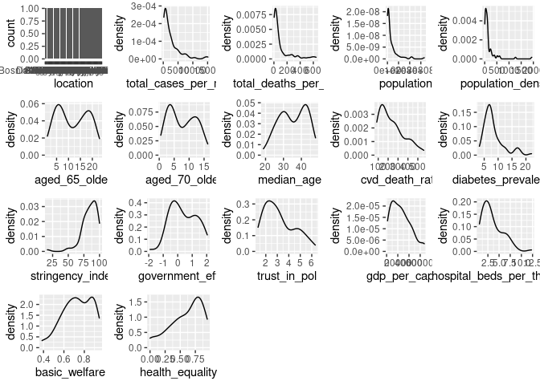

``` r
summary(cvd_vars)
```

``` chunk-output
##    location         total_cases_per_million total_deaths_per_million
##  Length:80          Min.   :  202.3         Min.   :  3.377         
##  Class :character   1st Qu.:  573.1         1st Qu.: 14.877         
##  Mode  :character   Median : 1332.8         Median : 39.287         
##                     Mean   : 2510.3         Mean   :101.883         
##                     3rd Qu.: 2977.9         3rd Qu.:104.947         
##                     Max.   :15106.5         Max.   :641.517         
##    population        population_density aged_65_older    aged_70_older   
##  Min.   :   875899   Min.   :   3.202   Min.   : 1.144   Min.   : 0.526  
##  1st Qu.:  5342587   1st Qu.:  32.053   1st Qu.: 5.875   1st Qu.: 3.491  
##  Median : 10566019   Median :  83.142   Median :11.143   Median : 7.157  
##  Mean   : 35961743   Mean   : 160.602   Mean   :11.746   Mean   : 7.662  
##  3rd Qu.: 43763080   3rd Qu.: 136.684   3rd Qu.:18.456   3rd Qu.:11.738  
##  Max.   :331002647   Max.   :1935.907   Max.   :23.021   Max.   :16.240  
##    median_age    cvd_death_rate   diabetes_prevalence stringency_index
##  Min.   :18.80   Min.   : 85.75   Min.   : 3.280      Min.   : 16.67  
##  1st Qu.:29.25   1st Qu.:133.55   1st Qu.: 5.798      1st Qu.: 76.85  
##  Median :35.50   Median :205.42   Median : 7.125      Median : 85.65  
##  Mean   :35.18   Mean   :237.52   Mean   : 8.212      Mean   : 83.95  
##  3rd Qu.:42.35   3rd Qu.:299.73   3rd Qu.: 9.328      3rd Qu.: 93.52  
##  Max.   :47.90   Max.   :559.81   Max.   :22.020      Max.   :100.00  
##  government_eff     trust_in_pol   gdp_per_capita  hospital_beds_per_thousand
##  Min.   :-1.9091   Min.   :1.324   Min.   : 1653   Min.   : 0.600            
##  1st Qu.:-0.3416   1st Qu.:2.134   1st Qu.:11431   1st Qu.: 1.675            
##  Median : 0.2977   Median :2.914   Median :23040   Median : 2.850            
##  Mean   : 0.3915   Mean   :3.180   Mean   :25226   Mean   : 3.489            
##  3rd Qu.: 1.1400   3rd Qu.:4.253   3rd Qu.:35975   3rd Qu.: 4.725            
##  Max.   : 2.0396   Max.   :6.306   Max.   :67335   Max.   :12.270            
##  basic_welfare    health_equality 
##  Min.   :0.3857   Min.   :0.0000  
##  1st Qu.:0.6403   1st Qu.:0.4605  
##  Median :0.7425   Median :0.6579  
##  Mean   :0.7288   Mean   :0.6000  
##  3rd Qu.:0.8661   3rd Qu.:0.8026  
##  Max.   :0.9464   Max.   :0.9474
```

Despite removing some outliers and a portion of the lowest values the
distributions are still quite skewed for some statistics, the robust
estimator functions may mitigate this in part. Additionally, the total
number of observations has continued to decrease, however as this is the
effort for evaluating the initial structure so we will proceed with the
analysis.

Specify Structure
-----------------

The DAG is now represented in Lavaan SEM format, latent variables
represent the structure of our DAG and the data collected is used as
measures of these latent variables.

``` r
init_model <- '
# latent variable model
pop_factors =~ population_density + population
age_risk =~ aged_65_older + aged_70_older + median_age
chronic_risk =~ cvd_death_rate + diabetes_prevalence
cases =~ total_cases_per_million
deaths =~ total_deaths_per_million
response_eff =~ trust_in_pol + government_eff + stringency_index
healthcare =~ basic_welfare + health_equality + hospital_beds_per_thousand


# regressions
cases ~ pop_factors + age_risk + response_eff
deaths ~ cases + age_risk + chronic_risk + healthcare

# covariance
chronic_risk ~~ age_risk
healthcare ~~ age_risk
aged_65_older ~~ aged_70_older
'
```

Lavaan produced and error and struggles to converge when variance
between variables is large, as such the variables have been rescaled
according to their distributions on a smaller scale.

``` r
cvd_vars <- cvd_vars %>% 
  mutate_at(vars(-location), rescale, to = c(0,1))
```

When gradient check is active the model appears to have converged but
there most variances and errors are NA, setting to false prevents some
of this error.

``` r
cvd_sem <- sem(init_model, data = cvd_vars, estimator = "MLR", check.gradient = FALSE)
```

Negative variance is often a sign of an unidentified model, however as
the model should be recursive this is unlikely to be the case, more
likely is that the structure is too different from what the data
represents and there is not possible solution, thus negative variances
have to be introduced in order to enable fitting to occur, unfortunately
negative variances indicate a failed model (Rosseel n.d.).

Research Evaluation
-------------------

As is evident from the analysis of the DAGs and SEM the structure
implied in the previous research was unlikely to produce a positive
outcome and is unlikely to represent the observations available in the
data. This is likely partly due to the choice to use countries for
evaluation, and the large count of endogenous variables in this model
represented by variables that are regressed by another variable. Further
efforts to modify this structure are unlikely to be fruitful and not
best practice (‘Best practices in SEM’ n.d.).

Build Up Approach and Confirmatory Factor Analysis (CFA)
========================================================

A preferable alternative to the approach taken previously is to build up
first a DAG, and then a model iterating informed by fit and variance
(‘Best practices in SEM’ n.d.) to increase complexity and improve fit.
An attempt at which is undertaken here. This attempt is still
constrained by the data already collected but presents an opportunity to
guide future investigation.

Simplified DAG
--------------

If we assume measurement error is not present, we can create a simple
DAG for the effect of age, this DAG presents an opportunity for CFA, the
measurement error is still somewhat accounted for by the SEM model.

``` r
a <- dagify(cases ~ age,
            death ~ age,
            death ~ cases)
ggdag(a) + theme_dag()
```

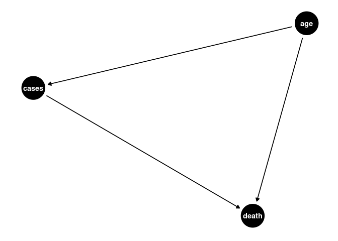 The above DAG shows age as a parent of both
cases and death, and cases as a parent of death, age is an exogenous
variable, while cases and death are endogenous. While extremely simple,
age is still a confounder in this DAG as a common cause of cases and
death in any efforts to investigate the effects of cases on death.
Deaths is the outcome variable, cases the contributing variable and age
an exposure.

New Outcome Variable
--------------------

The previous research utilised total deaths and cumulative measures.
Instead, the new outcome variable is created as the
new\_deaths\_per\_million, 4 weeks or 28 days after the first 100 cases.
This allows the DAG to represent a non-time-varying snapshot of the
pandemic. This allows time for gestation, and infection while also being
on the upslope of many countries new case curves. Finally, to aid
modelling the variance both new\_cases\_per\_million and
new\_deaths\_per\_million will be log transformed.

``` r
covid_new <- covid %>%
  filter(location != "World", location != "International") %>% 
  group_by(iso_code, week) %>% 
  summarise(
            week_start = first(date),
            week_end = last(date),
            new_cases = sum(new_cases),
            new_deaths = sum(new_deaths),
            new_cases_per_million = sum(new_cases_per_million),
            new_deaths_per_million = sum(new_deaths_per_million),
            new_tests = sum(new_tests),
            new_tests_per_thousand = sum(new_tests_per_thousand),
            stringency_index = mean(stringency_index)
            ) %>%
  ungroup()

join <- covid %>% 
  select(-new_cases, -new_deaths, -new_cases_per_million, -new_deaths_per_million, -new_tests, -new_tests_per_thousand, -week) %>% 
  mutate(week_end = date, -stringency_index)

covid_new_m <- merge(covid_new, join, by = c("iso_code", "week_end"))
```

``` r
ggplot(covid_new_m, aes(x = week, y = total_cases, color = location)) + geom_line()+ theme(legend.position = "none") + ylim(0, 2500)
```

 This visualisation, though messy aided in the
selection of an appropriate lower total case limit, looking for an
figure that was near the beginnings of initial slop increases.

``` r
cvd_100c <- covid_new_m %>% 
  group_by(iso_code) %>%
  filter(total_cases >= 100) %>% 
  arrange(week) %>% 
  mutate(weekoneplus = row_number()) %>% 
  ungroup()

ggplot(cvd_100c, aes(x = weekoneplus, y = new_cases_per_million, color = location)) + geom_line()+ theme(legend.position = "none")+ ylim(0, 2000)
```

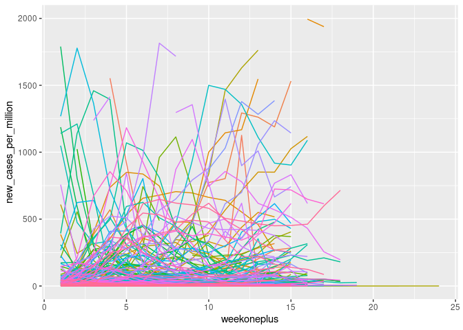 Again, not a clear visualisation but helpful
in selecting a new\_case\_per\_million value to reduce noise.

Log transformation of the variables induced unidentified values where
they were zero which had to be rectified.

``` r
cvd_100c_p4 <- cvd_100c %>% 
  group_by(iso_code) %>% 
  filter(weekoneplus == 4) %>% 
  ungroup() %>% 
  mutate(logndpm = log(new_deaths_per_million), logncpm = log(new_cases_per_million))

cvd_100c_p4[cvd_100c_p4$logndpm < -1000, "logndpm"] <- 0
cvd_100c_p4[cvd_100c_p4$logncpm < -1000, "logncpm"] <- 0

ggplot(cvd_100c_p4, aes(x = median_age, y = logndpm)) + geom_point()
```

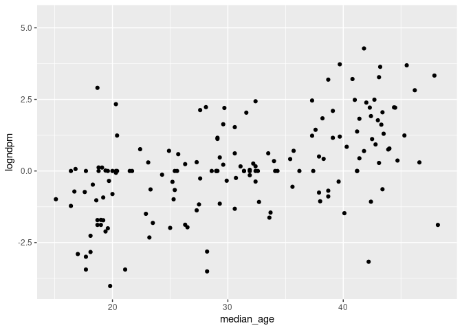

``` r
ggplot(cvd_100c_p4, aes(x = median_age, y = logncpm)) + geom_point()
```

 These visualisations show how log
transformation improves the clarity of the signal in both new cases and
new deaths.

``` r
dist_plots <- lapply(list("logncpm", "logndpm", "aged_65_older", "aged_70_older", "median_age"), function(var_x){
  p <- 
    ggplot(cvd_100c_p4) +
    aes_string(var_x)

  if(is.numeric(cvd_100c_p4[[var_x]])) {
    p <- p + geom_density()

  } else {
    p <- p + geom_bar()
  } 

})

plot_grid(plotlist = dist_plots)
```

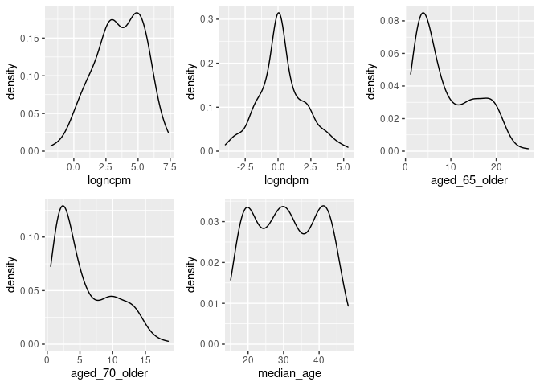 The distributions of our new variables
are again visualised before deploying the SEM model, while they are less
skewed than other variables utilised earlier, a robust estimator must
still be utilised.

CFA Model
---------

### Model 1- Age, Cases, Deaths

Though cases is a much less reliable statistic than deaths due to
measurement error differences in reporting and testing, etc (Our World
in Data 2020), not including it in analysis leaves few other
opportunities. As before, cases and deaths are latent variables of their
measured outcomes which accounts for some of this error, age is a latent
variable with three measures, median age of the country and proportions
aged 65+ and aged 70+. Covariance between aged 65+ and aged 70+ is
introduced due to their likely interaction.

``` r
cfa1_df <- cvd_100c_p4 %>% 
  mutate_at(vars(median_age, aged_65_older, aged_70_older, logncpm, logndpm), rescale, to = c(0,10))

cfa1_model <-'
# latent variables
age_risk =~ aged_70_older + median_age + aged_65_older
cases =~ logncpm
deaths =~ logndpm

# regressions (effects)
cases ~ age_risk
deaths ~ age_risk + cases

#covariances
aged_65_older ~~ aged_70_older
'

cfa1_sem <- cfa(cfa1_model, data = cfa1_df, estimator = "MLR")
summary(cfa1_sem, fit.measures=TRUE, standardized=TRUE)
```

``` chunk-output
## lavaan 0.6-6 ended normally after 85 iterations
## 
##   Estimator                                         ML
##   Optimization method                           NLMINB
##   Number of free parameters                         12
##                                                       
##                                                   Used       Total
##   Number of observations                           158         171
##                                                                   
## Model Test User Model:
##                                                Standard      Robust
##   Test Statistic                                 11.759       9.965
##   Degrees of freedom                                  3           3
##   P-value (Chi-square)                            0.008       0.019
##   Scaling correction factor                                   1.180
##        Yuan-Bentler correction (Mplus variant)                     
## 
## Model Test Baseline Model:
## 
##   Test statistic                              1183.269     800.856
##   Degrees of freedom                                10          10
##   P-value                                        0.000       0.000
##   Scaling correction factor                                  1.478
## 
## User Model versus Baseline Model:
## 
##   Comparative Fit Index (CFI)                    0.993       0.991
##   Tucker-Lewis Index (TLI)                       0.975       0.971
##                                                                   
##   Robust Comparative Fit Index (CFI)                         0.993
##   Robust Tucker-Lewis Index (TLI)                            0.977
## 
## Loglikelihood and Information Criteria:
## 
##   Loglikelihood user model (H0)              -1174.343   -1174.343
##   Scaling correction factor                                  1.221
##       for the MLR correction                                      
##   Loglikelihood unrestricted model (H1)      -1168.463   -1168.463
##   Scaling correction factor                                  1.213
##       for the MLR correction                                      
##                                                                   
##   Akaike (AIC)                                2372.686    2372.686
##   Bayesian (BIC)                              2409.437    2409.437
##   Sample-size adjusted Bayesian (BIC)         2371.451    2371.451
## 
## Root Mean Square Error of Approximation:
## 
##   RMSEA                                          0.136       0.121
##   90 Percent confidence interval - lower         0.061       0.049
##   90 Percent confidence interval - upper         0.222       0.201
##   P-value RMSEA <= 0.05                          0.033       0.052
##                                                                   
##   Robust RMSEA                                               0.132
##   90 Percent confidence interval - lower                     0.047
##   90 Percent confidence interval - upper                     0.226
## 
## Standardized Root Mean Square Residual:
## 
##   SRMR                                           0.011       0.011
## 
## Parameter Estimates:
## 
##   Standard errors                             Sandwich
##   Information bread                           Observed
##   Observed information based on                Hessian
## 
## Latent Variables:
##                    Estimate  Std.Err  z-value  P(>|z|)   Std.lv  Std.all
##   age_risk =~                                                           
##     aged_70_older     1.000                               2.250    0.929
##     median_age        1.197    0.069   17.370    0.000    2.694    0.970
##     aged_65_older     1.025    0.012   88.324    0.000    2.305    0.942
##   cases =~                                                              
##     logncpm           1.000                               2.028    1.000
##   deaths =~                                                             
##     logndpm           1.000                               1.712    1.000
## 
## Regressions:
##                    Estimate  Std.Err  z-value  P(>|z|)   Std.lv  Std.all
##   cases ~                                                               
##     age_risk          0.449    0.063    7.158    0.000    0.498    0.498
##   deaths ~                                                              
##     age_risk          0.227    0.054    4.239    0.000    0.299    0.299
##     cases             0.459    0.067    6.814    0.000    0.544    0.544
## 
## Covariances:
##                    Estimate  Std.Err  z-value  P(>|z|)   Std.lv  Std.all
##  .aged_70_older ~~                                                      
##    .aged_65_older     0.704    0.327    2.152    0.031    0.704    0.961
## 
## Variances:
##                    Estimate  Std.Err  z-value  P(>|z|)   Std.lv  Std.all
##    .aged_70_older     0.800    0.325    2.460    0.014    0.800    0.136
##    .median_age        0.453    0.364    1.245    0.213    0.453    0.059
##    .aged_65_older     0.670    0.329    2.035    0.042    0.670    0.112
##    .logncpm           0.000                               0.000    0.000
##    .logndpm           0.000                               0.000    0.000
##     age_risk          5.062    0.543    9.320    0.000    1.000    1.000
##    .cases             3.094    0.385    8.035    0.000    0.752    0.752
##    .deaths            1.326    0.140    9.485    0.000    0.452    0.452
```

This time modelling produced no errors and the fit measures are valid.
The output is quite long but can be addressed in sections. It should be
noted that measures are taken as their robust variants which are less
effected by non-normal distributions (Savalei 2018).

**Fit** SEM fit is a very loosely defined subject with many competing
recommendations, Gana and Broc detail this and provide their own
interpretation which will be the basis for model fit evaluation (Gana &
Broc 2018). Chi Squared significance (CSS) and SRMR are suggested as the
best indicator of absolute fit, the CSS value of 0.019 is below the 0.05
threshold indicating significance, unfortunately in SEM this indicates a
poor fit. However, SRMR of 0.011 is well below the threshold suggested
by G&B of 0.08 indicating a good fit. CFI and TLI indicate if the fit is
better than the null model, for both indicators a value &gt;0.95
indicates good fit. The model CFI 0.993 and TLI 0.977 are above this
threshold indicating the model is a better fit than the null model. AIC
and BIC are indicators of comparative fit between similar models, due to
the large changes being undertaken between model iterations in this
project are unlikely to be useful. Likelhood of RMSEA significance is
low, the RMSEA itself is low, however so are the confidence interval
bounds creating challenges in interpretation.

Overall, most fit indices indicate a good fit the DOF of the model is
quite low and the sample quite small potentially contributing the issues
with CSS values. The fit is not poor nor conclusive good either.

**Coefficients and Variances** The interpretation of coefficients and
variances in SEM is more challenging due to the fixing of some variances
and not other in the model, this behaviours can be modified but requires
significant interrogation of the underlying causal structure for latent
and total effects. For the above model, all variance estimates are
reasonable within their ranges, age risk is quite high comparative to
other variances but does not appear to be too unreasonable. Similarly,
some of the free z-values are significant. This indicates there are no
obvious errors within the model.

``` r
semPaths(cfa1_sem,  what = "stand", rotation = 2, layout = "tree")
```

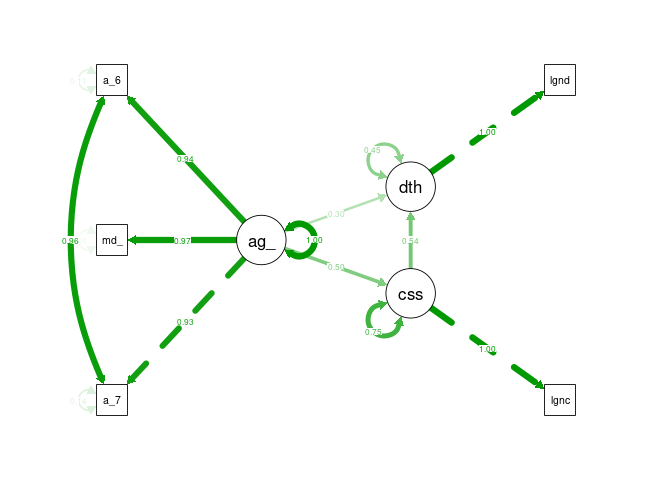 Again the variance estimates can be
visualised.

### Model 2 - Age, Cases, Chronic Illness, Deaths

``` r
a <- dagify(covid ~ age,
            death ~ age,
            death ~ covid,
            chronic ~ age,
            death ~ chronic,
            exposure = "chronic",
            outcome = "death"
            )
ggdag(a) + theme_dag()
```

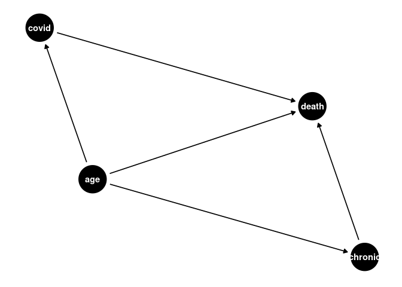 As the previous model indicated some
goodness of fit, I have chosen to continue exploration, and incorporate
further variables in order to asses the effect on the mode. The second
iteration introduces risk due to chronic disease, measured by
cardiovascular death rate and diabetes prevalence within the country.
Increased age is associated with increased risk of cardiovascular
disease, and we can test if our inference that this is further
associated with deaths was in the correct direction.

``` r
cfa2_df <- cvd_100c_p4 %>% 
  mutate_at(vars(median_age, aged_65_older, aged_70_older, logncpm, logndpm, cvd_death_rate, diabetes_prevalence), rescale, to = c(0,10))

cfa2_model <-'
# latent variables
age_risk =~ aged_70_older + median_age + aged_65_older
cases =~ logncpm
deaths =~ logndpm
chronic_disease =~ cvd_death_rate + diabetes_prevalence

# regressions (effects)
cases ~ age_risk
deaths ~ age_risk + cases + chronic_disease


#covariances
aged_65_older ~~ aged_70_older
'

cfa2_sem <- cfa(cfa2_model, data = cfa2_df, estimator = "MLR")
```

Despite many attempts to modify the structure and measures,
incorporating chronic disease risk as a latent variable induced negative
variances in the model, similar to the initial model. Therefore, this
model is a failure.

``` r
semPaths(cfa2_sem,  what = "stand", rotation = 2, layout = "tree")
```

 Here we can visualise where the negative
variances occur.

### CFA Model 3

``` r
a <- dagify(cases ~ age,
            death ~ age,
            death ~ cases,
            cases ~ mitigation
            )
ggdag(a) + theme_dag()
```

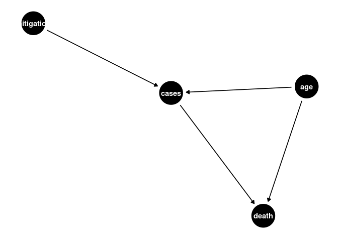 This DAG introduces the latent exogenous
variable mitigations, measured by stringency index, this variable is
associated with an effect on cases, as cases are likely to be effected
by changes in restrictions.

``` r
cfa4_df <- cvd_100c_p4 %>% 
  mutate_at(vars(median_age, aged_65_older, aged_70_older, logncpm, logndpm, cvd_death_rate, diabetes_prevalence, stringency_index.x), rescale, to = c(0,10))

cfa4_model <-'
# latent variables
age_risk =~ aged_70_older + median_age + aged_65_older
cases =~ logncpm
deaths =~ logndpm
mitigation =~ stringency_index.x

# regressions (effects)
cases ~ age_risk + mitigation
deaths ~ age_risk + cases

#covariances
aged_65_older ~~ aged_70_older
'

cfa4_sem <- cfa(cfa4_model, data = cfa4_df, estimator = "MLR")
summary(cfa4_sem, fit.measures=TRUE, standardized=TRUE)
```

``` chunk-output
## lavaan 0.6-6 ended normally after 95 iterations
## 
##   Estimator                                         ML
##   Optimization method                           NLMINB
##   Number of free parameters                         15
##                                                       
##                                                   Used       Total
##   Number of observations                           146         171
##                                                                   
## Model Test User Model:
##                                                Standard      Robust
##   Test Statistic                                 14.441      13.660
##   Degrees of freedom                                  6           6
##   P-value (Chi-square)                            0.025       0.034
##   Scaling correction factor                                   1.057
##        Yuan-Bentler correction (Mplus variant)                     
## 
## Model Test Baseline Model:
## 
##   Test statistic                              1117.732     859.202
##   Degrees of freedom                                15          15
##   P-value                                        0.000       0.000
##   Scaling correction factor                                  1.301
## 
## User Model versus Baseline Model:
## 
##   Comparative Fit Index (CFI)                    0.992       0.991
##   Tucker-Lewis Index (TLI)                       0.981       0.977
##                                                                   
##   Robust Comparative Fit Index (CFI)                         0.993
##   Robust Tucker-Lewis Index (TLI)                            0.982
## 
## Loglikelihood and Information Criteria:
## 
##   Loglikelihood user model (H0)              -1372.645   -1372.645
##   Scaling correction factor                                  1.269
##       for the MLR correction                                      
##   Loglikelihood unrestricted model (H1)      -1365.424   -1365.424
##   Scaling correction factor                                  1.209
##       for the MLR correction                                      
##                                                                   
##   Akaike (AIC)                                2775.289    2775.289
##   Bayesian (BIC)                              2820.043    2820.043
##   Sample-size adjusted Bayesian (BIC)         2772.577    2772.577
## 
## Root Mean Square Error of Approximation:
## 
##   RMSEA                                          0.098       0.094
##   90 Percent confidence interval - lower         0.032       0.027
##   90 Percent confidence interval - upper         0.164       0.158
##   P-value RMSEA <= 0.05                          0.097       0.114
##                                                                   
##   Robust RMSEA                                               0.096
##   90 Percent confidence interval - lower                     0.025
##   90 Percent confidence interval - upper                     0.165
## 
## Standardized Root Mean Square Residual:
## 
##   SRMR                                           0.014       0.014
## 
## Parameter Estimates:
## 
##   Standard errors                             Sandwich
##   Information bread                           Observed
##   Observed information based on                Hessian
## 
## Latent Variables:
##                    Estimate  Std.Err  z-value  P(>|z|)   Std.lv  Std.all
##   age_risk =~                                                           
##     aged_70_older     1.000                               2.285    0.930
##     median_age        1.183    0.069   17.238    0.000    2.702    0.968
##     aged_65_older     1.018    0.011   89.807    0.000    2.326    0.943
##   cases =~                                                              
##     logncpm           1.000                               2.034    1.000
##   deaths =~                                                             
##     logndpm           1.000                               1.725    1.000
##   mitigation =~                                                         
##     strngncy_ndx.x    1.000                               1.791    1.000
## 
## Regressions:
##                    Estimate  Std.Err  z-value  P(>|z|)   Std.lv  Std.all
##   cases ~                                                               
##     age_risk          0.488    0.062    7.839    0.000    0.548    0.548
##     mitigation        0.040    0.084    0.475    0.635    0.035    0.035
##   deaths ~                                                              
##     age_risk          0.240    0.057    4.219    0.000    0.317    0.317
##     cases             0.439    0.073    6.051    0.000    0.517    0.517
## 
## Covariances:
##                    Estimate  Std.Err  z-value  P(>|z|)   Std.lv  Std.all
##  .aged_70_older ~~                                                      
##    .aged_65_older     0.719    0.323    2.229    0.026    0.719    0.964
##   age_risk ~~                                                           
##     mitigation       -0.318    0.362   -0.877    0.380   -0.078   -0.078
## 
## Variances:
##                    Estimate  Std.Err  z-value  P(>|z|)   Std.lv  Std.all
##    .aged_70_older     0.820    0.321    2.550    0.011    0.820    0.136
##    .median_age        0.484    0.343    1.411    0.158    0.484    0.062
##    .aged_65_older     0.678    0.324    2.091    0.037    0.678    0.111
##    .logncpm           0.000                               0.000    0.000
##    .logndpm           0.000                               0.000    0.000
##    .strngncy_ndx.x    0.000                               0.000    0.000
##     age_risk          5.220    0.584    8.939    0.000    1.000    1.000
##    .cases             2.900    0.399    7.266    0.000    0.701    0.701
##    .deaths            1.345    0.143    9.397    0.000    0.452    0.452
##     mitigation        3.208    0.588    5.455    0.000    1.000    1.000
```

All fit measures are improved over the initial simplified model, though
chi-squared is still within the significant range. This model is a
better fit than the previous model overall, though still unlikely
objectively good fit.

``` r
semPaths(cfa4_sem,  what = "stand", rotation = 2, layout = "tree")
```

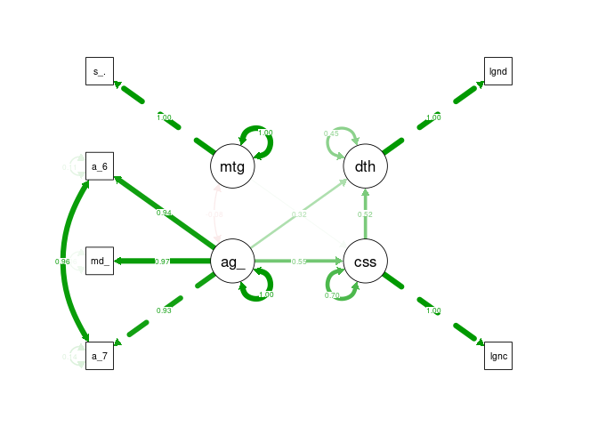 Quite similar to previous models, however there
is some negative covariance indicated between mitigations and age
related risk that was not included in the SEM.

**Static Statistics** Attempts were made to substitute in additional
static statistics such as government effectiveness and healthcare
however this often resulted in model errors or poorer fit.

Time Varying Model
------------------

The previous model while still not showing a good fit overall does
indicate that there is an improvement in fit when including mitigation
factors. The previous DAG is quite unrealistic however as the
relationship between these variables is time varying, as cases initially
drove stringency, and then stringency effects subsequent case numbers.
Developing a time-varying model induces significant bias that is
difficult to overcome, requiring g-methods (Hernán & Robins n.d.), but
may improve understanding of the structure.

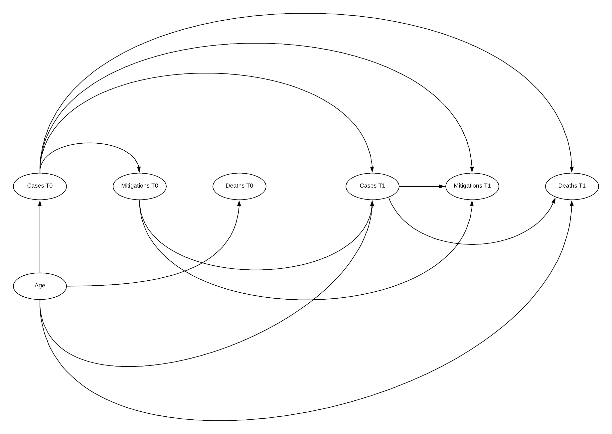

Here the DAG illustrates why time varying models are so challenging to
manage systematic bias within. Additionally, as outlined by Hernan,
there is often time-varying measurement error in such a model increasing
complexity, this has not been included here (Hernán & Robins n.d.). The
above DAG illustrates the relationship between an initial state 0, and a
subsequent state 1, this can be repeated n times. Below this state 0 is
the state we have been utilising previously, and state 1 is an
additional 4 weeks after state 0.

``` r
cvd_100c_p8 <- cvd_100c %>% 
  filter(iso_code != "ECU", weekoneplus == 8) %>% 
  mutate(logndpm = log(new_deaths_per_million), logncpm = log(new_cases_per_million))

cvd_100c_p8[cvd_100c_p8$logndpm < -1000, "logndpm"] <- 0
cvd_100c_p8[cvd_100c_p8$logncpm < -1000, "logncpm"] <- 0

timevar <- merge(cvd_100c_p4, cvd_100c_p8, by = "iso_code")
```

``` r
cfa_tv <- timevar %>% 
  mutate_at(vars(median_age.x, aged_65_older.x, aged_70_older.x, logncpm.x, logndpm.x, stringency_index.x.x,
                 median_age.y, aged_65_older.y, aged_70_older.y, logncpm.y, logndpm.y, stringency_index.x.y), rescale, to = c(0,10))

cfa_tv_model <-'
# latent variables
age_risk =~ aged_70_older.x + median_age.x + aged_65_older.x
cases0 =~ logncpm.x
cases1 =~ logncpm.y
deaths0 =~ logndpm.x
deaths1 =~ logndpm.y
mitigation0 =~ stringency_index.x.x
mitigation1 =~ stringency_index.x.y

# regressions (effects)

deaths1 ~ age_risk + cases1 + cases0
mitigation1 ~ cases0 + cases1 + mitigation0
cases1 ~ age_risk + mitigation0 + cases0
deaths0 ~ age_risk + cases0
mitigation0 ~ cases0
cases0 ~ age_risk

#covariances
aged_65_older.x ~~ aged_70_older.x
'

cfa_tv_sem <- sem(cfa_tv_model, data = cfa_tv, estimator = "MLR")
summary(cfa_tv_sem, fit.measures=TRUE, standardized=TRUE)
```

``` chunk-output
## lavaan 0.6-6 ended normally after 88 iterations
## 
##   Estimator                                         ML
##   Optimization method                           NLMINB
##   Number of free parameters                         29
##                                                       
##                                                   Used       Total
##   Number of observations                           124         158
##                                                                   
## Model Test User Model:
##                                                Standard      Robust
##   Test Statistic                                 33.106      28.620
##   Degrees of freedom                                 16          16
##   P-value (Chi-square)                            0.007       0.027
##   Scaling correction factor                                   1.157
##        Yuan-Bentler correction (Mplus variant)                     
## 
## Model Test Baseline Model:
## 
##   Test statistic                              1333.723     978.237
##   Degrees of freedom                                36          36
##   P-value                                        0.000       0.000
##   Scaling correction factor                                  1.363
## 
## User Model versus Baseline Model:
## 
##   Comparative Fit Index (CFI)                    0.987       0.987
##   Tucker-Lewis Index (TLI)                       0.970       0.970
##                                                                   
##   Robust Comparative Fit Index (CFI)                         0.989
##   Robust Tucker-Lewis Index (TLI)                            0.974
## 
## Loglikelihood and Information Criteria:
## 
##   Loglikelihood user model (H0)              -1769.517   -1769.517
##   Scaling correction factor                                  1.386
##       for the MLR correction                                      
##   Loglikelihood unrestricted model (H1)      -1752.963   -1752.963
##   Scaling correction factor                                  1.305
##       for the MLR correction                                      
##                                                                   
##   Akaike (AIC)                                3597.033    3597.033
##   Bayesian (BIC)                              3678.821    3678.821
##   Sample-size adjusted Bayesian (BIC)         3587.122    3587.122
## 
## Root Mean Square Error of Approximation:
## 
##   RMSEA                                          0.093       0.080
##   90 Percent confidence interval - lower         0.047       0.032
##   90 Percent confidence interval - upper         0.138       0.123
##   P-value RMSEA <= 0.05                          0.060       0.129
##                                                                   
##   Robust RMSEA                                               0.086
##   90 Percent confidence interval - lower                     0.029
##   90 Percent confidence interval - upper                     0.136
## 
## Standardized Root Mean Square Residual:
## 
##   SRMR                                           0.065       0.065
## 
## Parameter Estimates:
## 
##   Standard errors                             Sandwich
##   Information bread                           Observed
##   Observed information based on                Hessian
## 
## Latent Variables:
##                    Estimate  Std.Err  z-value  P(>|z|)   Std.lv  Std.all
##   age_risk =~                                                           
##     aged_70_oldr.x    1.000                               2.319    0.928
##     median_age.x      1.117    0.064   17.508    0.000    2.590    0.964
##     aged_65_oldr.x    1.013    0.012   86.402    0.000    2.349    0.942
##   cases0 =~                                                             
##     logncpm.x         1.000                               2.102    1.000
##   cases1 =~                                                             
##     logncpm.y         1.000                               1.989    1.000
##   deaths0 =~                                                            
##     logndpm.x         1.000                               1.766    1.000
##   deaths1 =~                                                            
##     logndpm.y         1.000                               2.237    1.000
##   mitigation0 =~                                                        
##     strngncy_ndx..    1.000                               1.778    1.000
##   mitigation1 =~                                                        
##     strngncy_ndx..    1.000                               1.748    1.000
## 
## Regressions:
##                    Estimate  Std.Err  z-value  P(>|z|)   Std.lv  Std.all
##   deaths1 ~                                                             
##     age_risk          0.376    0.104    3.603    0.000    0.390    0.390
##     cases1            0.595    0.109    5.462    0.000    0.529    0.529
##     cases0            0.038    0.152    0.249    0.803    0.036    0.036
##   mitigation1 ~                                                         
##     cases0           -0.010    0.076   -0.126    0.900   -0.012   -0.012
##     cases1            0.172    0.107    1.614    0.107    0.196    0.196
##     mitigation0       0.731    0.091    8.052    0.000    0.743    0.743
##   cases1 ~                                                              
##     age_risk         -0.253    0.069   -3.684    0.000   -0.295   -0.295
##     mitigation0      -0.063    0.080   -0.789    0.430   -0.056   -0.056
##     cases0            0.857    0.079   10.911    0.000    0.906    0.906
##   deaths0 ~                                                             
##     age_risk          0.268    0.063    4.242    0.000    0.351    0.351
##     cases0            0.418    0.078    5.340    0.000    0.497    0.497
##   mitigation0 ~                                                         
##     cases0           -0.061    0.083   -0.736    0.462   -0.072   -0.072
##   cases0 ~                                                              
##     age_risk          0.524    0.066    7.926    0.000    0.578    0.578
## 
## Covariances:
##                      Estimate  Std.Err  z-value  P(>|z|)   Std.lv  Std.all
##  .aged_70_older.x ~~                                                      
##    .aged_65_oldr.x      0.753    0.317    2.377    0.017    0.753    0.962
##  .deaths0 ~~                                                              
##    .deaths1             0.951    0.188    5.065    0.000    0.563    0.563
##    .mitigation1        -0.103    0.116   -0.891    0.373   -0.077   -0.077
##  .deaths1 ~~                                                              
##    .mitigation1        -0.276    0.197   -1.401    0.161   -0.162   -0.162
## 
## Variances:
##                    Estimate  Std.Err  z-value  P(>|z|)   Std.lv  Std.all
##    .aged_70_oldr.x    0.866    0.322    2.693    0.007    0.866    0.139
##    .median_age.x      0.509    0.313    1.623    0.104    0.509    0.071
##    .aged_65_oldr.x    0.706    0.313    2.258    0.024    0.706    0.114
##    .logncpm.x         0.000                               0.000    0.000
##    .logncpm.y         0.000                               0.000    0.000
##    .logndpm.x         0.000                               0.000    0.000
##    .logndpm.y         0.000                               0.000    0.000
##    .strngncy_ndx..    0.000                               0.000    0.000
##    .strngncy_ndx..    0.000                               0.000    0.000
##     age_risk          5.375    0.527   10.195    0.000    1.000    1.000
##    .cases0            2.940    0.446    6.588    0.000    0.665    0.665
##    .cases1            1.553    0.222    7.001    0.000    0.393    0.393
##    .deaths0           1.333    0.165    8.095    0.000    0.427    0.427
##    .deaths1           2.140    0.295    7.243    0.000    0.428    0.428
##    .mitigation0       3.144    0.624    5.041    0.000    0.995    0.995
##    .mitigation1       1.354    0.320    4.232    0.000    0.443    0.443
```

Somewhat surprisingly, there were no errors in processing the model.
Unfortunately, model fit indicators are performing poorer, CSS is
decreased and SRMR has increased above the 0.05 threshold. Comparative
fit indices are reduced, though RMSEA is also reduced which is positive.
A worthwhile test, but unfortunately not fully successful.

``` r
semPaths(cfa_tv_sem,  what = "stand", rotation = 2, layout = "tree")
```

 As there were errors in processing the
model it may be interesting if we assume there was no inititial
mitigation, as there would have been at the start of the pandemic and
modify the structure as such.

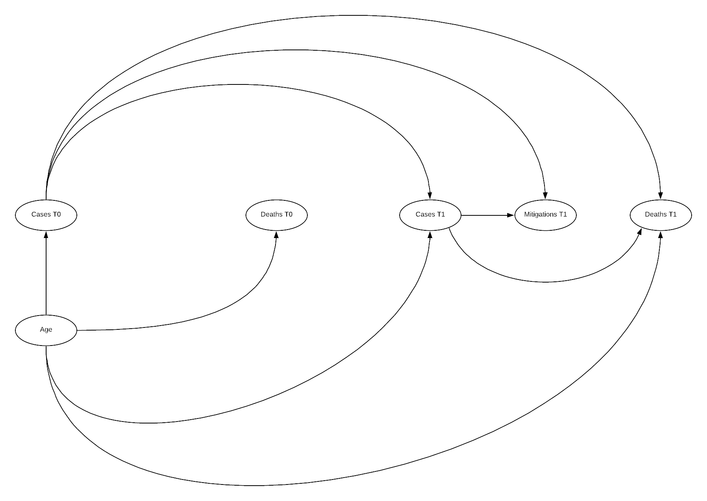

``` r
cfa_tv_model <-'
# latent variables
age_risk =~ aged_70_older.x + median_age.x + aged_65_older.x
cases0 =~ logncpm.x
cases1 =~ logncpm.y
deaths0 =~ logndpm.x
deaths1 =~ logndpm.y
mitigation1 =~ stringency_index.x.y

# regressions (effects)

deaths1 ~ age_risk + cases1 + cases0
mitigation1 ~ cases0 + cases1
cases1 ~ age_risk  + cases0
deaths0 ~ age_risk + cases0
cases0 ~ age_risk

#covariances
aged_65_older.x ~~ aged_70_older.x
'

cfa_tv_sem <- sem(cfa_tv_model, data = cfa_tv, estimator = "MLR")
summary(cfa_tv_sem, fit.measures=TRUE, standardized=TRUE)
```

``` chunk-output
## lavaan 0.6-6 ended normally after 90 iterations
## 
##   Estimator                                         ML
##   Optimization method                           NLMINB
##   Number of free parameters                         25
##                                                       
##                                                   Used       Total
##   Number of observations                           124         158
##                                                                   
## Model Test User Model:
##                                                Standard      Robust
##   Test Statistic                                 20.495      17.991
##   Degrees of freedom                                 11          11
##   P-value (Chi-square)                            0.039       0.082
##   Scaling correction factor                                   1.139
##        Yuan-Bentler correction (Mplus variant)                     
## 
## Model Test Baseline Model:
## 
##   Test statistic                              1218.338     919.909
##   Degrees of freedom                                28          28
##   P-value                                        0.000       0.000
##   Scaling correction factor                                  1.324
## 
## User Model versus Baseline Model:
## 
##   Comparative Fit Index (CFI)                    0.992       0.992
##   Tucker-Lewis Index (TLI)                       0.980       0.980
##                                                                   
##   Robust Comparative Fit Index (CFI)                         0.993
##   Robust Tucker-Lewis Index (TLI)                            0.983
## 
## Loglikelihood and Information Criteria:
## 
##   Loglikelihood user model (H0)              -1573.616   -1573.616
##   Scaling correction factor                                  1.267
##       for the MLR correction                                      
##   Loglikelihood unrestricted model (H1)      -1563.369   -1563.369
##   Scaling correction factor                                  1.228
##       for the MLR correction                                      
##                                                                   
##   Akaike (AIC)                                3197.232    3197.232
##   Bayesian (BIC)                              3267.739    3267.739
##   Sample-size adjusted Bayesian (BIC)         3188.688    3188.688
## 
## Root Mean Square Error of Approximation:
## 
##   RMSEA                                          0.083       0.072
##   90 Percent confidence interval - lower         0.018       0.000
##   90 Percent confidence interval - upper         0.139       0.126
##   P-value RMSEA <= 0.05                          0.150       0.237
##                                                                   
##   Robust RMSEA                                               0.076
##   90 Percent confidence interval - lower                     0.000
##   90 Percent confidence interval - upper                     0.138
## 
## Standardized Root Mean Square Residual:
## 
##   SRMR                                           0.036       0.036
## 
## Parameter Estimates:
## 
##   Standard errors                             Sandwich
##   Information bread                           Observed
##   Observed information based on                Hessian
## 
## Latent Variables:
##                    Estimate  Std.Err  z-value  P(>|z|)   Std.lv  Std.all
##   age_risk =~                                                           
##     aged_70_oldr.x    1.000                               2.321    0.929
##     median_age.x      1.115    0.066   16.983    0.000    2.587    0.963
##     aged_65_oldr.x    1.013    0.012   86.612    0.000    2.351    0.942
##   cases0 =~                                                             
##     logncpm.x         1.000                               2.102    1.000
##   cases1 =~                                                             
##     logncpm.y         1.000                               1.982    1.000
##   deaths0 =~                                                            
##     logndpm.x         1.000                               1.763    1.000
##   deaths1 =~                                                            
##     logndpm.y         1.000                               2.230    1.000
##   mitigation1 =~                                                        
##     strngncy_ndx..    1.000                               1.752    1.000
## 
## Regressions:
##                    Estimate  Std.Err  z-value  P(>|z|)   Std.lv  Std.all
##   deaths1 ~                                                             
##     age_risk          0.354    0.107    3.320    0.001    0.369    0.369
##     cases1            0.586    0.110    5.314    0.000    0.521    0.521
##     cases0            0.058    0.153    0.376    0.707    0.054    0.054
##   mitigation1 ~                                                         
##     cases0           -0.061    0.105   -0.583    0.560   -0.074   -0.074
##     cases1            0.182    0.115    1.582    0.114    0.206    0.206
##   cases1 ~                                                              
##     age_risk         -0.237    0.074   -3.214    0.001   -0.277   -0.277
##     cases0            0.850    0.080   10.684    0.000    0.902    0.902
##   deaths0 ~                                                             
##     age_risk          0.261    0.063    4.112    0.000    0.344    0.344
##     cases0            0.422    0.079    5.369    0.000    0.503    0.503
##   cases0 ~                                                              
##     age_risk          0.524    0.066    7.911    0.000    0.578    0.578
## 
## Covariances:
##                      Estimate  Std.Err  z-value  P(>|z|)   Std.lv  Std.all
##  .aged_70_older.x ~~                                                      
##    .aged_65_oldr.x      0.742    0.334    2.219    0.027    0.742    0.962
##  .deaths0 ~~                                                              
##    .deaths1             0.951    0.187    5.072    0.000    0.563    0.563
##    .mitigation1        -0.025    0.166   -0.150    0.880   -0.012   -0.012
##  .deaths1 ~~                                                              
##    .mitigation1        -0.117    0.254   -0.461    0.645   -0.046   -0.046
## 
## Variances:
##                    Estimate  Std.Err  z-value  P(>|z|)   Std.lv  Std.all
##    .aged_70_oldr.x    0.855    0.339    2.523    0.012    0.855    0.137
##    .median_age.x      0.520    0.329    1.580    0.114    0.520    0.072
##    .aged_65_oldr.x    0.696    0.331    2.104    0.035    0.696    0.112
##    .logncpm.x         0.000                               0.000    0.000
##    .logncpm.y         0.000                               0.000    0.000
##    .logndpm.x         0.000                               0.000    0.000
##    .logndpm.y         0.000                               0.000    0.000
##    .strngncy_ndx..    0.000                               0.000    0.000
##     age_risk          5.386    0.528   10.201    0.000    1.000    1.000
##    .cases0            2.941    0.446    6.594    0.000    0.666    0.666
##    .cases1            1.567    0.224    6.991    0.000    0.399    0.399
##    .deaths0           1.332    0.165    8.091    0.000    0.429    0.429
##    .deaths1           2.140    0.295    7.248    0.000    0.430    0.430
##    .mitigation1       2.992    0.605    4.943    0.000    0.975    0.975
```

The above model indicates good fit across all fit indices! Chi-squared
has moved above the significant threshold, though still low, SRMR
increased though is still below the threshold. CFI and TLI are both
improved, similarly across all RMSE indicators. The paths visualisation
is similar to previous visualisations. There are some suggested
improvements in the model, however disconnecting mitigations 1 from
cases 0 is unlikely to be represented of the true causal path.

``` r
reliability(cfa_tv_sem)
```

``` chunk-output
##     alpha     omega    omega2    omega3    avevar 
## 0.9748320 0.9367829 0.9367829 0.9374871 0.8947247
```

All reliability scores are above the threshold.

``` r
resid(cfa_tv_sem, "cor")
```

``` chunk-output
## $type
## [1] "cor.bollen"
## 
## $cov
##                      a_70_. mdn_g. a_65_. lgncpm.x lgncpm.y lgndpm.x lgndpm.y
## aged_70_older.x       0.000                                                  
## median_age.x         -0.002  0.000                                           
## aged_65_older.x       0.000 -0.001  0.000                                    
## logncpm.x             0.008  0.018 -0.011  0.000                             
## logncpm.y             0.006  0.021 -0.013  0.000    0.000                    
## logndpm.x             0.021 -0.001  0.011  0.000   -0.023    0.000           
## logndpm.y             0.034  0.002  0.021  0.004   -0.009   -0.007    0.000  
## stringency_index.x.y -0.129 -0.054 -0.140  0.000    0.000   -0.035   -0.035  
##                      str_..
## aged_70_older.x            
## median_age.x               
## aged_65_older.x            
## logncpm.x                  
## logncpm.y                  
## logndpm.x                  
## logndpm.y                  
## stringency_index.x.y  0.000
```

There appears to be no highly significant difference between observed
and implied correlations, stringency sitting just above threshold
values, though the statistics indicate the model tends over predict
correlation resulting in mostly negative values (Michael Hallquist
2018).

Overall indications are that a time varying model is the most accurate,
particularly when there is a zero state present where no mitigation was
taken, this could potentially relate to a need to lead and lag some
variables. Hernan suggests that in order to undertake investigation into
time varying causal models, g-methods must be implemented. (Hernán &
Robins n.d.)

G-methods
---------

Attempts were made to incorporate g-methods based on counterfactual
consistency and inverse weighting (Naimi, Cole & Kennedy 2016) as
described by Hernan, using the gfoRmula package (Lin et al. 2019)
however, these methods require a much deeper understanding of
statistics, expert knowledge of the subject matter and best practice.
The referenced paper (Naimi, Cole & Kennedy 2016) opens that uptake by
professional epidemiologists was hampered by the complexities
understanding concepts and technical details.

First the structure of the data needs to be modified into the format ID,
time index, covariates, treatment, outcome. For the analysis this will
be, iso\_code, weekoneplus, covariates (log of new cases per million,
median age), stringency index, log of new deaths per million.

``` r
 cvd_g <- cvd_100c %>% 
  mutate(weekoneplus = weekoneplus -1) %>% 
  filter(iso_code != "ECU", iso_code != "UGA", iso_code != "BEN",
         iso_code != "CTU", iso_code != "FIN", iso_code != "ESP", iso_code != "LTU") %>% 
  mutate(logndpm = log(new_deaths_per_million), logncpm = log(new_cases_per_million)) %>% 
  mutate_at(vars(median_age, aged_65_older, aged_70_older, logncpm, logndpm, stringency_index.x), rescale, to = c(0,10)) %>% 
  select(iso_code, weekoneplus, median_age, logncpm, logndpm, stringency_index.x) %>% 
  na.omit()
  
cvd_g[cvd_g$logndpm < -1000, "logndpm"] <- 0
cvd_g[cvd_g$logncpm < -1000, "logncpm"] <- 0

cvd_g$iso_code <- as.factor(cvd_g$iso_code)
cvd_g_n <- cvd_g
cvd_g_n$iso_code <- as.numeric(cvd_g_n$iso_code)

gmethdf <- cvd_g_n %>% 
  filter(weekoneplus <= 5) %>% 
  mutate(weekoneplus = weekoneplus -1) %>% 
  filter(iso_code != 10, iso_code != 42, iso_code != 3, iso_code != 124, iso_code != 148, iso_code != 78, iso_code != 90, iso_code != 92, iso_code != 96, iso_code != 129)
```

Transformation complete now into model structure. (Lin et al. 2019)

``` r
gformula_continuous_eof(obs_data = gmethdf,
                        id = "iso_code",
                        time_name = "weekoneplus",
                        outcome_name = "logndpm",
                        covnames = c("logncpm", "stringency_index.x"),
                        basecovs = "median_age",
                        covtypes = c("normal", "normal"),
                        histories = c(lagged),
                        histvars = list(c("logncpm", "stringency_index.x")),
                        covparams = list(covmodels = c(
                          logncpm ~ lag1_logncpm + lag1_stringency_index.x + weekoneplus,
                          stringency_index.x ~ lag1_logncpm + weekoneplus
                        )),
                        ymodel = logndpm ~ median_age + logncpm + lag1_logncpm + stringency_index.x + lag1_stringency_index.x,
                        seed = 222
                        )
```

Unfortunately I could not trouble shoot the error “Error in
int\_result/ref\_mean : non-numeric argument to binary operator” despite
numerous modifications. Further work will be required to implement this
model type.

Outcomes
========

Conclusions
-----------

It is evident from the analysis in [Appendix B](#appendix-b) that the
structure and casual pathways implied by the previous research effort
(Danny Lei Han et al. 2020) induced many opportunities for systemic bias
and few attempts to mitigate these. The inability to model the implied
DAG in SEM aids to verify this assumption that it is unlikely the
inferred casual pathways were reflected in the observational data. Later
efforts to develop a model that could aid in developing future research
efforts were necessarily quite simplified structures. Most efforts met
with minimal success with a mix of good and poor fit indications. The
final time varied effort revealed a potential causal structure that is
reflected in the observational data, however while most indices
indicated good fit, most were still close to acceptable threshold
values. Unfortunately modelling utilising g-methods methods was
unsuccessful, however this approach is a potential candidate for
evaluating a full time varied model effectively.

Reflection
----------

The deeper I dove into Structural Equation Modelling and Causal
Inference the more I realised the topic of COVID-19 is far too complex
and the data too incomplete or poorly recorded for the application of
these methods to be truly effective. While these methods are
requirements to understanding the pandemic, due particularly to the
large amount of observational data available, their application by an
amateur and with limited data is unlikely to see any positive outcomes.

That said, of the available methods these were by far the most
interesting to me, I chose to peruse this method based on that interest.
The method opens understanding into not only new statistical methods as
observed in other methods, but frameworks for identifying, communicating
and assessing complex problems utilising DAGs and causal inference,
topics which I will continue to investigate. To this end I kept on
digging my hole deeper, I have learnt a great deal however the outcomes
could have been improved. I believe including other areas of statics
would have potentially improved overall outcomes on reflection,
particularly looking into time series and accurately interpret lead and
lag of variables, or potentially create a multi-level SEM model.

Overall, I’m glad I chose this method for the learning opportunities I
gained, achieving a just passable fit on the complex time varied model
was enough of an achievement. As long as I interpreted the outcomes
correctly. \# References

‘Best practices in SEM’ n.d.

Danny Lei Han, Emma Valme, Hemendra Patil, Joshua McCarthy, Lhalid
Almundayfir & Leon MA 2020, *COVID19\_COVIDResearch\_20200727.Pdf*.

Gana, K. & Broc, G. 2018, *Structural Equation Modeling with lavaan*,
John Wiley & Sons, Inc., Hoboken, NJ, USA.

‘GovData360: Health equality’ n.d., *GovData360*.

HarvardX PH559x 2020, *Causal Diagrams: Draw Your Assumptions Before
Your Conclusions*.

Hernán, M.A. & Robins, J.M. n.d., *Causal Inference: What If*, p. 311.

‘How would I set up second order factors (hierarchical models) for
confirmatory factor analysis in the R package ’lavaan’?’ n.d.,
*ResearchGate*.

‘Institutional Profiles Database’ n.d.

Lin, V., McGrath, S., Zhang, Z., Petito, L.C., Logan, R.W., Hernán, M.A.
& Young, J.G. 2019, ‘gfoRmula: An R package for estimating effects of
general time-varying treatment interventions via the parametric
g-formula’, *arXiv:1908.07072 \[stat\]*.

Michael Hallquist 2018, *Introductory SEM using lavaan*.

Naimi, A.I., Cole, S.R. & Kennedy, E.H. 2016, ‘An Introduction to G
Methods’, *International Journal of Epidemiology*, p. dyw323.

Our World in Data 2020, ‘Owid/covid-19-data’, *GitHub*.

‘OxCGRT/covid-policy-tracker’ 2020.

Rosseel, Y. n.d., *Structural Equation Modeling with lavaan*, p. 127.

Savalei, V. 2018, ‘On the Computation of the RMSEA and CFI from the
Mean-And-Variance Corrected Test Statistic with Nonnormal Data in SEM’,
*Multivariate Behavioral Research*, vol. 53, no. 3, pp. 419–29.

Thakkar, J.J. 2020, *Structural Equation Modelling: Application for
Research and Practice (with AMOS and R)*, Studies in Systems, Decision
and Control, vol. 285, Springer Singapore, Singapore.

‘WGI 2019 Interactive &gt; Home’ n.d.

Apendicies
==========

Appendix A
----------

Appendix A
----------

*Implied Structure* Repeated instances of the same implication in a
different section are not repeated. The implications measured and or
posited through analysis are highlighted in bold

#### Introduction

1.  **Total cases per million population varied between locations due to
    measured and unmeasured factors**
2.  Extremely small population countries had very high case/population
    due to their low population
3.  **Total deaths per million population is less dependent on
    cases/population than other factors**
4.  Extremely small population countries had very high deaths/population
    due to their low population
5.  **The responses a countries government makes in response to covid
    are causes for variation between cases and deaths per population**
6.  More responses indicate a “better” response

#### Country Based Age Influence

1.  Age distribution between countries is a result of many unobserved
    factors
2.  **Age of a population effects the outcomes during pandemic’s
    epidemics and emergencies such as COVID-19**
3.  **Conditioning age to higher values is associated with poorer
    COVID-19 outcomes**
4.  Variation in COVID-19 outcomes is not only associated with age
5.  **The total deaths are associated with an increased time since
    initial COVID-19 infections**
6.  Industrialized nations are associated with a higher median age
7.  Richer countries may be associated with a higher median age. (We can
    take richer here to mean GDP per capita)
8.  Recording of death due to COVID may be subject to error
9.  Methods of classifying deaths due to covid may have contributed to
    causing that error
10. Conditioning on age does not rule out associations between increased
    risk and other factors

#### Patient Case Based Analysis

1.  Being the first country exposed to COVID is associated with
    comprehensive data collection
2.  Disclosure of information varies between countries
3.  Is there an association between COVID symptoms and chronic diseases
4.  Is increased age associated with chronic disease
5.  Is increased age associated with weakened immune system and
    therefore more susceptible to COVID
6.  Conditioning reproduction number to 1 is causally associated with
    disease spread (transmission)
7.  Conditioning on reproduction number 0 is associated with and end of
    transmission 24 High reproduction rate causes increase in
    pharmaceutical (medical) interventions
8.  Medical interventions are associated with reduced transmission
9.  Symptom onset is associated with time since infection
10. Longer time periods between exposure and onset of symptoms is a
    cause of transmission
11. Identification of symptoms for COVID is associated with
    identification of symptoms for the flu
12. COVID patients with poor outcomes is caused by the immune system
    attacking healthy cells (immune disorder)
13. Immune disorder is associated with infection
14. Immune disorder is associated with organ failure
15. Mean of age distribution is associated with true age
16. **Conditioning location to the United States is associated with
    higher age**
17. **Conditioning location the United States is associated with a lower
    rate of infection at lower ages**
18. Conditioning location to the United States is associated with
    increased cases
19. Symptoms are associated with chronic disease
20. Symptoms are associated with COVID
21. COVID diagnosis is negatively associated with the presence of
    symptoms due to chronic disease

Conditioning for individuals with COVID; 39. **Conditioning symptoms to
pneumonia is associated with chronic disease** 39. **Conditioning
symptoms to acute respiratory is associated with chronic disease** 40.
**Conditioning symptoms to mild is associated with chronic disease**

1.  symptoms associated with chronic disease may be associated with age

#### Global Factors Influencing Variation in Healthcare Effectiveness

1.  Higher deaths is associated with poorer outcomes
2.  Higher cases is associated with poorer outcomes
3.  Increased stringency is associated with poorer outcomes
4.  More recent dates are associated with poorer outcomes
5.  Maximum cases causes maximum deaths
6.  Health equality may be measure of the quality of healthcare and or
    maximum cases and or maximum deaths
7.  Basic welfare may be measure of the quality of healthcare and or
    maximum cases and or maximum deaths
8.  Quality of basic healthcare may be measure of the quality of
    healthcare and or maximum cases and or maximum deaths
9.  Access to public healthcare may be a measure of the quality of
    healthcare and or maximum cases and or maximum deaths
10. Healthcare expenditure as a percentage of GDP may be measure of the
    quality of healthcare and or maximum cases and or maximum deaths
11. **Basic welfare is associated with median age**
12. **Stringency index is associated with deaths/cases per million
    population**
13. **Lead/lag time between maximum cases and deaths is associated with
    deaths/case per million**
14. **Quality of healthcare statistics were not associated with
    deaths/case per million population**

#### Effectiveness of Response

1.  Mitigations are associated with improved COVID outcomes
2.  Social distancing is associated with mitigation
3.  Closing schools is associated with mitigation
4.  Shutting down restaurants is associated with mitigation
5.  Controlling traffic is associated with mitigation
6.  Mitigations are associated with reduced infection rates
7.  Traffic control may be associated with confirmed cases
8.  Apple mobility metrics are associated with traffic control

#### Global Factors Influencing Variation in Response and Government

1.  Deaths prior to restriction are not associated with deaths after
    restrictions
2.  Public Trust in politicians is associated with effectiveness of
    response
3.  Public Government Effectiveness is associated with effectiveness of
    response
4.  Effectiveness of response may be associated with deaths prior to
    and/or after restrictions change
5.  Conditional restriction levels were associated with increased deaths
    compared to previous 21 day period
6.  **Effectiveness in government is not associated with the above
    variables**

Appendix B
----------

### Introduction

The following figure indicates the casual graph implied in the
introduction of the report, the implied structure contains many sources
of systematic bias. The first challenge is that the measured statistics
are subject to error and do not represent the true occurrences. There
are likely to be common causes of error in measuring cases and deaths
due to COVID, e.g. asymptomatic patients and testing strategies.
Additionally, being diagnosed with COVID is likely to influence your
chance of death and weather your death will be recorded as COVID
related, the bias implied by this structure is dependent differential
bias (Hernán & Robins n.d.) and causes bias even under the null making
it quite challenging to negate. Further, when trying to determine the
effect of population on deaths there is confounding due to the common
cause of response, similarly, there is confounding if any unmeasured
factor affecting cases and deaths is common. There is also potential for
selection bias at the collider deaths, as we would be conditioning on
recorded deaths in analysis. This shows that the inferences made in the
introduction should be reassessed. Further investigation of Cusal DAGs
is available in [Appendix B](#appendix-b)


### Country Based Age Influence

When investigating the effect of age on deaths, conditioning age on
higher values opens the path to other unmeasured effects on age
identified. Previously identified measurement bias is consistent in
these analyses. Applying certain regression methods to age is a viable
method of reducing the effect of confounding due to common cause of age,
however the measurement bias is still present.


### Patient Case Based Analysis

The issue with continually building on prior inferences without a
framework for evaluating their structure becomes more evident here. In
verifying the reason for using this dataset we instead identify two
potential shared causes for measurement error; disclosure and time since
first case. Additionally, as this research in focused on patient data,
the location variable is introduced, a common cause of many of the
observations and therefore likely to confound any analysis. It is
identified that we can condition on this variable for example selecting
only patient from the USA, which would potentially reduce confounding at
the risk of introducing selection bias, and observe changes in
distributions, however the research did not utilise this in regression.
The directionality of the graph becomes quite complex with the
introduction of chronic disease, introducing another source of
differential dependent error. In determining if there is a connection
between chronic disease and particular symptoms, conditioning symptoms
opens the collider inducing selection bias, age appears to act as an
additional confounder.


### Factors and Effectiveness

All the factor analyses introduce selection biases as they select for
varying conditions of outcome variables or deaths, in addition to the
other bias’s observed previously. The chosen observed variables are also
likely to be associated with other parts of the DAG acting as common
cause confounders.

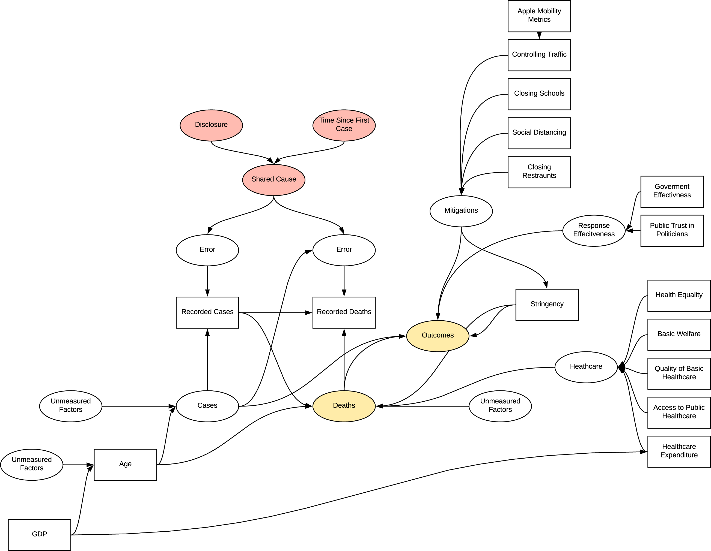

### Time Varying Treatment

In both the patient based and response investigations, time varying
treatment bias is introduced into the model, the complexity in
displaying this prevents visualisation. In patient based investigation,
the bias is due to the effect of the change in quality of treatment as
understanding of the virus improved effecting the symptoms and observed.
In the response investigations, as the response effects both cases and
future response we see a similar effect.

### Full Implied Structure

The implied structure by the research is quite flawed and has many
inherent sources of systematic bias in the experiments undertaken which
were not accounted for. The structure is complex developed as the
research progressed, further detailing of bias in this model is unlikely
to be beneficial.


